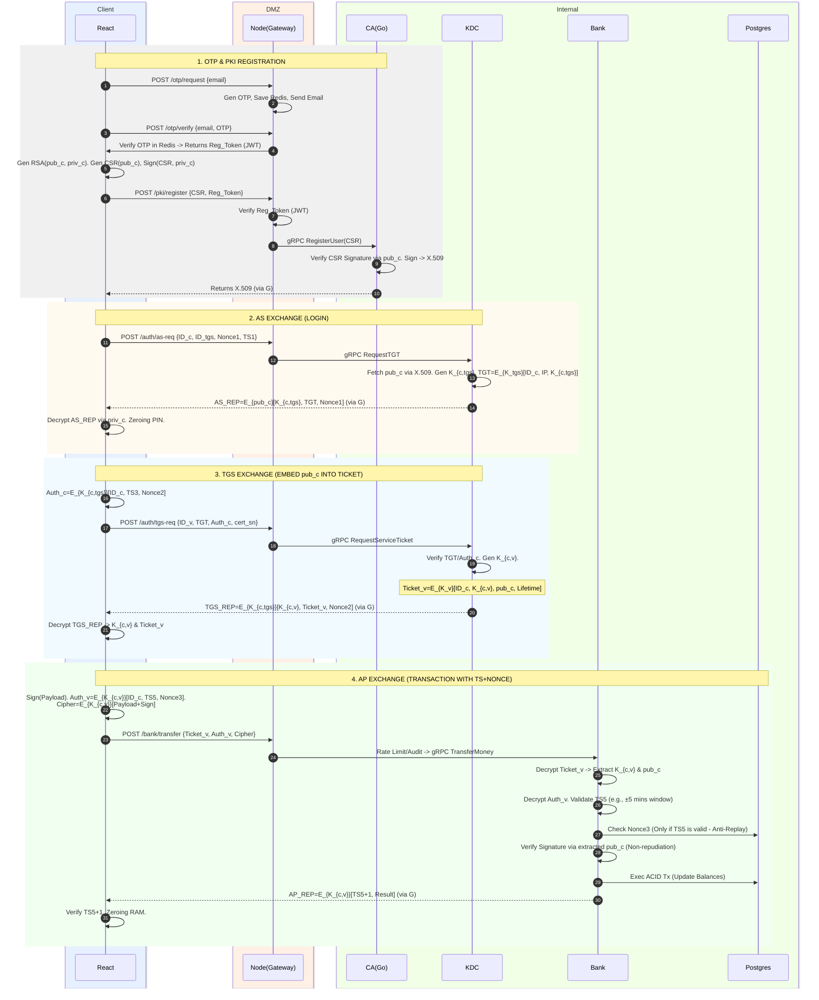

# MINI APP BANKING

---

# Overview

Hệ thống triển khai mô hình xác thực bảo mật nhiều lớp kết hợp:

* OTP Verification
* Public Key Infrastructure (PKI)
* X.509 Certificate
* Kerberos-like Authentication Flow
* Digital Signature
* Session Key Encryption

## Kiến trúc gồm các thành phần

| Thành phần       | Công nghệ               | Vai trò                  |
| ---------------- | ----------------------- | ------------------------ |
| **Client**       | React                   | Giao diện người dùng     |
| **Gateway**      | Node.js                 | API Gateway / DMZ        |
| **CA Service**   | Go                      | Certificate Authority    |
| **KDC**          | Authentication Server   | Cấp Ticket & Session Key |
| **Bank Service** | Backend Banking Service | Xử lý giao dịch          |
| **Redis**        | In-memory DB            | Lưu OTP tạm thời         |
| **PostgreSQL**   | Database                | Lưu dữ liệu giao dịch    |

---

# Storage Lifecycle

Vòng đời và phạm vi lưu trữ của từng loại dữ liệu được hệ thống quy định nghiêm ngặt:

## Phía Trình Duyệt (Client-Side)

* **Mã PIN:**
  Lưu dưới dạng mảng byte có thể thay đổi (`Uint8Array`). Chỉ tồn tại cục bộ trong khối lệnh, bị ghi đè thành số 0 ngay sau khi giải mã xong khóa (*Zeroing / Memory Wiping*).

* **Khóa bí mật Client (`privKeyRSA_c`):**
  Lưu bền vững trong trình duyệt (IndexedDB) dưới dạng Wrapped Key (mã hóa bằng AES dẫn xuất từ PIN). Khi nạp vào RAM, sử dụng WebCrypto API với `extractable: false`, ngăn chặn hoàn toàn việc trích xuất khóa gốc.

* **Khóa công khai của KDC (`pubKeyRSA_KDC`):**
  Được hardcode sẵn trong mã nguồn Client (Public data, chỉ dùng để xác minh, không cần giấu).

* **Registration Token (JWT)***
  Lưu trữ tạm thời trong RAM. Bị hủy bỏ ngay khi Phase 1 (Đăng ký PKI) hoàn tất. Không bao giờ lưu JWT này vào LocalStorage để tránh bị lạm dụng cấp lại chứng chỉ

* **Chứng chỉ X.509 (X.509_pem):***
  Lưu trong IndexedDB/LocalStorage. Đây là dữ liệu công khai (Public Data). Không cần bảo vệ tính bí mật, nhưng cần bảo vệ tính toàn vẹn (tự động verify chữ ký của CA/KDC khi sử dụng).

* **Khóa phiên (K_{c,tgs}, K_{c,v}) và Vé (TGT, Ticket_v):**
  Chỉ lưu trong bộ nhớ RAM tạm thời (Session state của React). Tự động bị dọn dẹp khi đóng tab hoặc khi TGT hết hạn.

## Phía Máy Chủ (Server-Side)
* **Các Khóa Chủ (Master Keys: privKeyRSA_ca, privKeyRSA_KDC, K_tgs, K_v):***
  Lưu trữ trong Dịch vụ Quản lý Khóa (KMS - Key Management Service). Tồn tại vĩnh viễn.

* **OTP, Nonce & Timestamp:**
  Lưu trên In-memory Database (Redis) với cấu trúc Atomic. Ràng buộc bởi Time-To-Live (TTL) rất ngắn. OTP thường hết hạn sau 2-5 phút. Nonce cache thường hết hạn trong 5 phút.

* **Nhật ký Kiểm toán & Lịch sử Giao dịch (Audit Logs & Ledger)**
  Lưu trong PostgreSQL (Banking DB). Cần lưu trữ dài hạn, thiết kế theo dạng Append-Only (Chỉ thêm mới) kèm theo chữ ký số của Client để phục vụ đối soát pháp lý.

---

# Secure Banking Authentication Flow



---

# PHASE 1: OTP & PKI REGISTRATION

## Mục tiêu của giai đoạn

Đảm bảo định danh người dùng thông qua xác thực Email (OTP) và thiết lập định danh an toàn.

Hệ thống áp dụng nguyên tắc **Zero-Knowledge** trong việc khởi tạo khóa:

> Khóa bí mật `privKeyRSA_c` được sinh ra và lưu trữ độc lập tại thiết bị của người dùng thông qua WebCrypto API, máy chủ hoàn toàn không có khả năng can thiệp hay sao chép khóa này.

---

## Quy trình Xử lý Chi tiết

### Bước 1: Yêu cầu mã xác thực (Request OTP)

* **Thao tác:**
  Người dùng nhập Email để tạo tài khoản thông qua xác thực OTP.


* **Xử lý tại Gateway:**
  Node.js sinh mã OTP ngẫu nhiên, lưu vào Redis:

| Thành phần | Giá trị     |
| ---------- | ----------- |
| Key        | Email       |
| Value      | OTP         |
| TTL        | Có thời hạn |

Sau đó gọi API gửi OTP về email của người dùng.

---

### Bước 2: Xác minh OTP (Verify OTP)

* **Thao tác:**
  Người dùng nhập xác nhận OTP.

* **Xử lý tại Gateway:**
  Node.js truy vấn Redis để:

1. Đối chiếu OTP
2. Kiểm tra thời hạn

Nếu hợp lệ, Gateway trả về Registration Token (JWT).

---

### Bước 3: Khởi tạo Cặp khóa & Yêu cầu ký chứng chỉ

#### Tạo khóa

Người dùng thiết lập mã PIN cục bộ.

React App dùng Web Crypto API sinh cặp khóa:

* `pubKeyRSA_c`
* `privKeyRSA_c`

---

#### Tạo và ký CSR

Client tạo:

```text
Certificate Signing Request (CSR)
```

CSR chứa:

* `ID_c (username, email)`
* `pubKeyRSA_c`

Người dùng tiến hành ký CSR để chứng minh tính sở hữu

```text
Sign(CSR, privKeyRSA_c)
```

---

#### Gửi yêu cầu

Client tiến hành gửi CSR_pem và JWT lên Server để xin cấp chứng chỉ X509.

---

### Bước 4: Thẩm định và Cấp phát Chứng chỉ X.509

#### Gateway

* Xác thực JWT
* Forward CSR sang CA Service qua gRPC

---

#### CA Service (Proof of Possession)

CA thực hiện:

1. Bóc tách CSR lấy `pubKeyRSA_c`
2. Verify chữ ký trên CSR
3. Xác minh Client thực sự sở hữu `privKeyRSA_c`

---

#### Đúc chứng chỉ

CA dùng:

```text
privKeyRSA_ca
```

để ký điện tử và tạo chứng chỉ:

```text
X.509
```

---

#### Hoàn tất

CA trả:

```text
X.509_pem
```

về Gateway → Gateway forward về Client.

Client lưu:

* `X.509_pem`
* `privKeyRSA_c` (đã mã hóa)

để dùng cho các phiên đăng nhập tiếp theo.

---

# PHASE 2: INITIAL AUTHENTICATION (AS EXCHANGE)

## Mục tiêu của giai đoạn

Đảm bảo Client có thể lấy:

* Ticket-Granting Ticket (`TGT`)
* Session Key (`K_{c,tgs}`)

Hệ thống tận dụng PKI từ Phase 1 để bảo mật việc phân phối khóa.

---

## Quy trình Xử lý Chi tiết

### Bước 1: Client khởi tạo yêu cầu (AS_REQ)

Client tiến hành gửi as-req với nội dung Payload

Payload:

| Trường    | Ý nghĩa               |
| --------- | --------------------- |
| `ID_c`    | Định danh người dùng  |
| `ID_tgs`  | Định danh dịch vụ TGS |
| `Nonce_1` | Chống Replay Attack   |
| `TS_1`    | Timestamp hiện tại    |

---

### Bước 2: KDC xử lý và đóng gói AS_REP

Gateway forward request sang KDC qua gRPC.

#### Định danh & Sinh khóa

KDC:

1. Tra cứu `ID_c`
2. Lấy chứng chỉ X.509
3. Trích xuất `pubKeyRSA_c`
4. Sinh khóa:

```text
K_{c,tgs}
```

---

#### Tạo TGT

TGT chứa:

```text
{
  ID_c,
  Client_IP,
  K_{c,tgs},
  Lifetime
}
```

Được mã hóa:

```text
E_{K_tgs}[...]
```

---

#### Ký số

KDC gom:

```text
{ K_{c,tgs}, TGT, Nonce_1 }
```

và ký bằng:

```text
privKeyRSA_KDC
```

---

#### Mã hóa bảo mật

Toàn bộ dữ liệu được mã hóa tiếp bằng:

```text
pubKeyRSA_c
```

Kết quả:

```text
AS_REP = E_{pubKeyRSA_c}[ Signed_Data ]
```

---

### Bước 3: Client giải mã AS_REP & Zeroing Memory

#### Giải mã

Người dùng nhập PIN.

PIN (`Uint8Array`) được dùng để:

* unwrap `privKeyRSA_c`
* giải mã `AS_REP`

---

#### Xác minh

Client:

1. Dùng `pubKeyRSA_KDC` verify chữ ký
2. Kiểm tra `Nonce_1`
3. Kiểm tra `TS_1`

---

#### Session & Memory Wiping

Nếu hợp lệ:

* Lưu `K_{c,tgs}`
* Lưu `TGT`

vào Session Memory.

Ngay sau đó:

```text
Memory Zeroing
```

* Ghi đè PIN bằng `0x00`
* Ghi đè plaintext private key bằng `0x00`

---

# PHASE 3: TGS EXCHANGE (XIN VÉ DỊCH VỤ)

## Mục tiêu của giai đoạn

Đây là giai đoạn bản lề trong kiến trúc Kerberos.

Client hiện đang giữ:

1. `K_{c,tgs}`
2. `TGT`

Mục tiêu:

* Xin `Ticket_v`
* Xin `K_{c,v}`

để giao tiếp an toàn với Bank Server.

---

## Quy trình Xử lý

### Bước 1: Client tạo Authenticator

Client sinh:

```text
Auth_c
```

để:

* chứng minh quyền sở hữu TGT
* chống Replay Attack

---

#### Sinh nonce

```text
nonce_req = crypto.getRandomValues(16 bytes)
```

---

#### Plaintext

```text
{
  ID_c,
  TS_3,
  nonce_req,
  requested_service = ID_v
}
```

---

#### Mã hóa AES-256-GCM

| Thành phần | Giá trị         |
| ---------- | --------------- |
| Key        | `K_{c,tgs}`     |
| IV         | random 12 bytes |

---

### Bước 2: Client gửi TGS_REQ

Client tiến hành gửi tgs-req với nội dung Payload

Payload:

* `ID_v`
* `TGT`
* `Auth_c`
* `cert_serial`

---

### API Gateway xử lý

Gateway:

1. Validate protobuf schema
2. Rate limit
3. Forward gRPC + mTLS vào internal network

---

### Bước 3: TGS xử lý và kiểm định

#### Kiểm tra TGT

KDC giải mã TGT bằng:

```text
K_tgs
```

Lấy:

* `K_{c,tgs}`
* `ID_c`
* `Client_address`
* `TS_tgt`
* `Lifetime_tgt`

---

#### Kiểm tra chứng chỉ

* Check CRL / revoke
* Check trạng thái account

---

#### Xác minh Auth_c

Giải mã bằng:

```text
K_{c,tgs}
```

Verify:

```text
ID_{c_auth} == ID_c
```

và:

```text
requested_service == ID_v
```

---

#### Freshness & Replay Check

Điều kiện:

```text
|now - TS_3| < 5 phút
```

Replay detection:

```text
hash(nonce_req + ID_c + TS_3)
```

lưu vào Redis:

```text
SET(key, "1", EX=300, NX=true)
```

Nếu key tồn tại → Reject.

---

### Bước 4: TGS cấp Ticket_v

#### Sinh tài nguyên mới

```text
K_{c,v} = crypto.getRandomValues(32 bytes)
```

```text
nonce_2 = crypto.getRandomValues(16 bytes)
```

---

#### Tạo Ticket_v

Mã hóa bằng:

```text
AES-256-GCM
```

Payload:

```text
{
  ID_c,
  sname = ID_v,
  TS_4,
  Lifetime_v,
  K_{c,v},
  pubKey_c,
  nonce_req
}
```

---

#### Tạo TGS_REP

Mã hóa bằng:

```text
K_{c,tgs}
```

Payload:

```text
{
  K_{c,v},
  ID_v,
  TS_4,
  nonce_2,
  nonce_req,
  Ticket_v
}
```

---

### Bước 5: Client nhận Ticket_v

Client:

1. Giải mã `TGS_REP`
2. Verify `nonce_req`
3. Lưu `K_{c,v}`
4. Lưu `Ticket_v`

Lúc này Client đã sẵn sàng thực hiện giao dịch ở Phase 4.

---

# PHASE 4: AP EXCHANGE (GIAO DỊCH BẢO MẬT & XÁC THỰC HAI CHIỀU)

## Mục tiêu của giai đoạn

Kết hợp:

1. **Kerberos Symmetric Encryption**
2. **PKI Digital Signature**

để đạt được:

* tốc độ cao
* non-repudiation
* mutual authentication

---

## Điều kiện đầu vào

### Client

Đang giữ:

* `K_{c,v}`
* `Ticket_v`

trong RAM.

`privKeyRSA_c` đang được lưu dưới dạng wrapped key trong IndexedDB.

---

### Bank Server

Nắm giữ:

```text
K_v
```

---

## Quy trình Xử lý Chi tiết

### Bước 1: Ký số và Mã hóa tại Client

Người dùng nhập:

* Payload chuyển tiền
* PIN

---

#### Unwrap private key

PIN được dùng để unwrap:

```text
privKeyRSA_c
```

Khóa được đánh dấu:

```text
extractable: false
```

---

#### Tạo chữ ký số

Client:

1. Hash Payload
2. Ký bằng:

```text
privKeyRSA_c
```

---

#### Tạo Auth_v

```text
Auth_v = E_{K_{c,v}}[
    ID_c +
    TS_5 +
    Nonce_3
]
```

---

#### Tạo CipherPayload

```text
CipherPayload = E_{K_{c,v}}[
    Payload +
    Signature
]
```

---

#### Memory Zeroing

Ngay sau khi ký:

* overwrite PIN
* overwrite plaintext private key

bằng `0x00`.

---

#### Gửi request

Client gửi:

```text
{
  Ticket_v,
  Auth_v,
  CipherPayload
}
```

---

### Bước 2: API Gateway định tuyến

Gateway thực hiện:

* Rate Limiting
* Audit Logging

sau đó forward sang Bank Service qua gRPC.

---

### Bước 3: Bank Server xác thực

#### Giải mã Ticket_v

Bank Server dùng:

```text
K_v
```

để lấy:

* `K_{c,v}`
* `ID_c`
* `pubKey_c`
* ticket lifetime

---

#### Verify Auth_v

Bank Server:

1. Giải mã `Auth_v`
2. Verify `ID_c`
3. Verify `TS_5`
4. Verify `Nonce_3`

---

#### Verify chữ ký số

Bank Server:

1. Giải mã `CipherPayload`
2. Lấy:

   * Payload
   * Signature
3. Verify bằng:

```text
pubKey_c
```

Nếu hợp lệ:

> Giao dịch được xác nhận là do chính chủ thực hiện.

---

### Bước 4: Xử lý nghiệp vụ ngân hàng

Bank Server:

* Kiểm tra số dư
* Update PostgreSQL
* Đảm bảo ACID Transaction
* Lưu Audit Log + Signature

---

### Bước 5: Mutual Authentication

Bank Server chuẩn bị:

```text
AP_REP = E_{K_{c,v}}[
    Result +
    TS_5 + 1
]
```

và gửi lại cho Client.

---

### Bước 6: Client xác minh phản hồi

Client:

1. Giải mã `AP_REP`
2. Verify `TS_5 + 1`
3. Xác nhận Mutual Authentication
4. Xóa Session & Session Key khỏi RAM
5. Hiển thị:

```text
"Giao dịch thành công"
```

---
