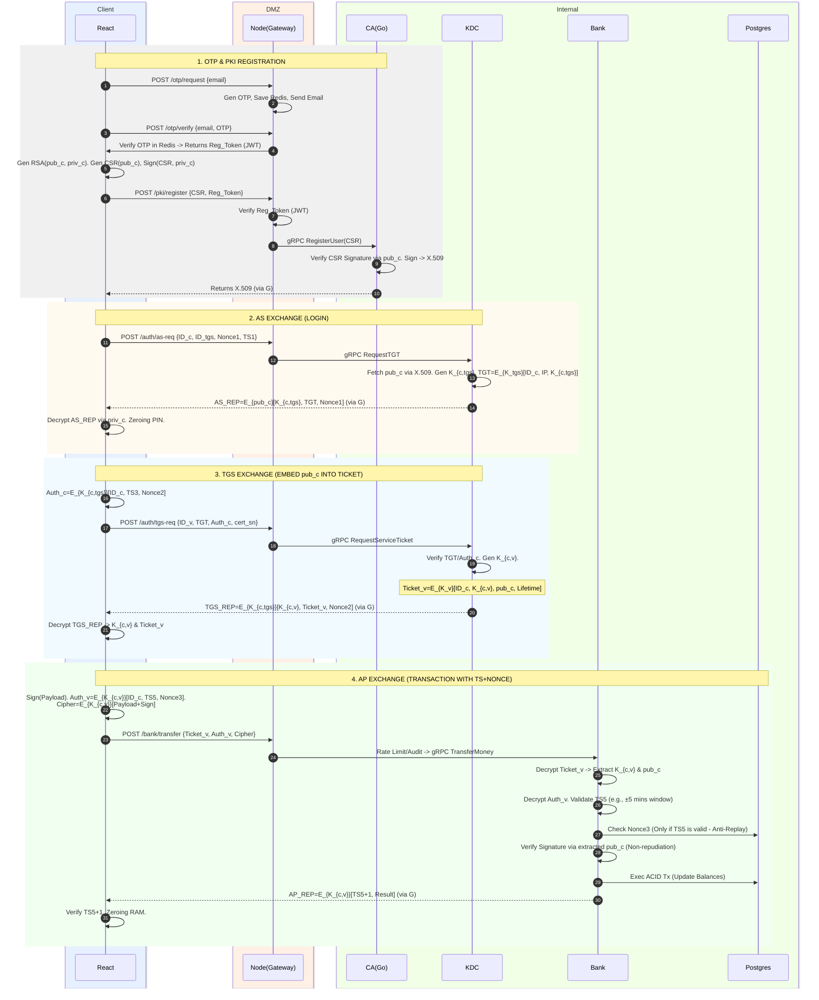

# MINI APP BANKING

## Overview

Hệ thống triển khai mô hình xác thực bảo mật nhiều lớp kết hợp:

* OTP Verification
* Public Key Infrastructure (PKI)
* X.509 Certificate
* Kerberos-like Authentication Flow
* Digital Signature
* Session Key Encryption

**Kiến trúc gồm các thành phần:**

| Thành phần | Công nghệ | Vai trò |
| --- | --- | --- |
| **Client** | React | Giao diện người dùng |
| **Gateway** | Node.js | API Gateway / DMZ |
| **CA Service** | Go | Certificate Authority |
| **KDC** | Authentication Server | Cấp Ticket & Session Key |
| **Bank Service** | Backend Banking Service | Xử lý giao dịch |
| **Redis** | In-memory DB | Lưu OTP tạm thời |
| **PostgreSQL** | Database | Lưu dữ liệu giao dịch |

---

## Storage Lifecycle

Vòng đời và phạm vi lưu trữ của từng loại dữ liệu được hệ thống quy định nghiêm ngặt:

* **Mật khẩu / Mã PIN:** Lưu dưới dạng mảng byte có thể thay đổi (`Uint8Array`). Chỉ tồn tại cục bộ trong khối lệnh, bị ghi đè thành số 0 ngay sau khi giải mã xong khóa (Cơ chế *Zeroing/Memory Wiping*).
* **Khóa bí mật Client (`privKeyRSA_c`):** Lưu bền vững trong trình duyệt (IndexedDB) dưới dạng Wrapped Key (mã hóa bằng AES dẫn xuất từ PIN). Khi nạp vào RAM, sử dụng WebCrypto API đánh dấu `extractable: false`, ngăn chặn hoàn toàn việc trích xuất khóa gốc.
* **Khóa phiên (`K_{c,tgs}`) và Vé (`TGT`):** Chỉ lưu trong bộ nhớ RAM tạm thời (Session state của React). Tự động bị dọn dẹp khi đóng tab hoặc khi TGT hết hạn.
* **Khóa công khai của KDC (`pubKeyRSA_KDC`):** Được hardcode sẵn trong mã nguồn Client (Đây là Public data, chỉ dùng để xác minh, không cần giấu).
* **Nonce và Timestamp:** Tồn tại theo vòng đời của hàm (Function lifecycle), dùng để đính kèm vào yêu cầu và kiểm tra tính hợp lệ khi nhận phản hồi.

---

## Secure Banking Authentication Flow



---

## PHASE 1: OTP & PKI REGISTRATION

### Mục tiêu của giai đoạn

Đảm bảo định danh người dùng thông qua xác thực Email (OTP) và thiết lập định danh an toàn. Hệ thống áp dụng nguyên tắc Zero-Knowledge trong việc khởi tạo khóa: Khóa bí mật (`privKeyRSA_c`) được sinh ra và lưu trữ độc lập tại thiết bị của người dùng (WebCrypto API), máy chủ hoàn toàn không có khả năng can thiệp hay sao chép khóa này.

### Quy trình Xử lý Chi tiết

#### Bước 1: Yêu cầu mã xác thực (Request OTP)

* **Thao tác:** Người dùng nhập Email. Client gửi yêu cầu `POST /api/otp/request`.
* **Xử lý tại Gateway:** Node.js sinh mã OTP ngẫu nhiên, lưu vào Redis (với Key là Email, Value là OTP, có cấu hình TTL) và gọi API gửi Email.

#### Bước 2: Xác minh OTP (Verify OTP)

* **Thao tác:** Người dùng nhập mã OTP. Client gửi yêu cầu `POST /api/otp/verify` kèm Email và OTP.
* **Xử lý tại Gateway:** Node.js truy vấn Redis để đối chiếu OTP và kiểm tra hạn sử dụng. Nếu hợp lệ, Gateway trả về `Registration_Token` dưới dạng JWT.

#### Bước 3: Khởi tạo Cặp khóa & Yêu cầu ký chứng chỉ

* **Tạo khóa:** Người dùng thiết lập mã PIN cục bộ (để mã hóa private key). React App dùng Web Crypto API sinh cặp khóa phi đối xứng: `pubKeyRSA_c` và `privKeyRSA_c`.
* **Tạo và Ký CSR:** Client tạo gói Certificate Signing Request (CSR) chứa định danh `ID_c` và `pubKeyRSA_c`. Để chứng minh quyền sở hữu, Client ký điện tử lên CSR bằng `privKeyRSA_c` -> `Sign(CSR, privKeyRSA_c)`.
* **Gửi yêu cầu:** Client gửi `CSR_pem` và `Registration_Token` qua endpoint `POST /api/pki/register`.

#### Bước 4: Thẩm định và Cấp phát Chứng chỉ X.509

* **Gateway:** Xác thực tính hợp lệ của `Registration_Token` (JWT). Nếu hợp lệ, chuyển tiếp `CSR_pem` tới CA Service bằng gRPC.
* **CA Service (Proof of Possession):** CA bóc tách CSR lấy `pubKeyRSA_c`. Dùng khóa này để giải mã và kiểm tra chữ ký trên chính CSR. Nếu khớp, chứng tỏ Client thực sự đang giữ `privKeyRSA_c`.
* **Đúc chứng chỉ:** CA trích xuất `pubKeyRSA_c`, sử dụng khóa bí mật chủ `privKeyRSA_ca` để ký điện tử và tạo ra chứng chỉ định dạng **X.509**.
* **Hoàn tất:** CA Service trả `X.509_pem` về cho Node.js, sau đó forward về Client. Client lưu trữ chứng chỉ này cùng `privKeyRSA_c` (đã mã hóa) để dùng cho các phiên làm việc tiếp theo.

---

## PHASE 2: INITIAL AUTHENTICATION (AS EXCHANGE)

### Mục tiêu của giai đoạn

Đảm bảo Client có thể lấy được Vé Cấp Vé (Ticket-Granting Ticket - `TGT`) và Khóa phiên làm việc chung (`K_{c,tgs}`) từ máy chủ KDC mà **không cần phải truyền mật khẩu qua mạng**. Áp dụng hạ tầng PKI (từ Giai đoạn 1) để bảo mật quá trình phân phối khóa.

### Quy trình Xử lý Chi tiết

#### Bước 1: Client khởi tạo yêu cầu (AS_REQ)

Client đóng gói các thông tin thành request bản rõ (Plaintext) và gửi `POST /auth/as-req`. Payload bao gồm:

* `ID_c`: Định danh người dùng (từ Username).
* `ID_tgs`: Định danh dịch vụ TGS (Hardcode sẵn).
* `Nonce_1`: Số ngẫu nhiên dùng một lần chống Replay Attack (lưu tạm ở RAM).
* `TS_1`: Timestamp hiện tại của hệ thống.

#### Bước 2: Máy chủ KDC xử lý và Đóng gói phản hồi (AS_REP)

Gateway nhận HTTP Request và chuyển tiếp qua gRPC vào KDC.

* **Định danh & Sinh khóa:** KDC tra cứu `ID_c`, lấy chứng chỉ X.509 và trích xuất `pubKeyRSA_c`. Sau đó, KDC sinh khóa đối xứng ngẫu nhiên `K_{c,tgs}` dùng cho phiên làm việc.
* **Tạo Vé (TGT):** KDC tạo TGT chứa `{ ID_c, Client_IP, K_{c,tgs}, Lifetime }`. TGT được mã hóa bằng khóa bí mật nội bộ của KDC (`E_{K_tgs}[...]`) để Client không thể đọc hay chỉnh sửa.
* **Ký số (Authentication):** KDC gom `{K_{c,tgs}, TGT, Nonce_1}` và ký số bằng `privKeyRSA_KDC`. Việc này giúp Client tin tưởng gói tin đến từ KDC hợp lệ.
* **Mã hóa (Confidentiality):** Toàn bộ cục dữ liệu đã ký tiếp tục được mã hóa bằng `pubKeyRSA_c`. Giờ đây, chỉ người sở hữu `privKeyRSA_c` mới có thể giải mã.
* *Kết quả:* `AS_REP = E_{pubKeyRSA_c}[ Signed_Data ]`


#### Bước 3: Client giải mã AS_REP và Tiêu hủy dữ liệu (Zeroing Memory)

* **Giải mã (Web Crypto API):** Người dùng nhập PIN. PIN (dạng `Uint8Array`) được dùng làm khóa unwrap để giải mã lớp vỏ ngoài của `AS_REP` thông qua `privKeyRSA_c` lấy từ IndexedDB.
* **Xác minh & Đối chiếu:** Client lấy `pubKeyRSA_KDC` (đã hardcode) để xác minh chữ ký điện tử. Sau đó, kiểm tra `Nonce_1` và `TS_1` có khớp với request ban đầu để chống Replay Attack.
* **Lưu Session & Memory Wiping:** Nếu hợp lệ, Client lưu `K_{c,tgs}` và `TGT` vào Session Memory. Ngay lập tức, mã nguồn thực thi **Memory Zeroing**: Ghi đè mảng byte chứa PIN và vùng nhớ plaintext của Private Key thành `0x00` để chống dump memory.

---

## PHASE 3: TGS EXCHANGE (XIN VÉ DỊCH VỤ)

### Mục tiêu của giai đoạn

Đây là giai đoạn bản lề trong kiến trúc Kerberos, đóng vai trò như một "trạm kiểm soát" để cấp quyền cho Client truy cập vào Bank Server mà không cần người dùng phải gửi lại mật khẩu.

Lúc này, Client đã đăng nhập thành công ở Phase 2 và đang giữ trong RAM hai tài sản:

1. Khóa phiên cấp 1: `K_{c,tgs}` (chia sẻ giữa Client và máy chủ TGS).
2. Vé thông hành dài hạn: `TGT` (đã bị mã hóa, Client không đọc được).

Để thực hiện giao dịch chuyển tiền, Client cần xin một Vé dịch vụ ngắn hạn (`Ticket_v`) và một Khóa phiên mới (`K_{c,v}`) để giao tiếp riêng với Bank Server một cách an toàn.

### Quy trình Xử lý

#### Bước 1: Client chuẩn bị Yêu cầu và tạo Authenticator

Thay vì chỉ gửi TGT đi một cách đơn thuần, Client phải chứng minh mình là chủ nhân thực sự của TGT này (đang nắm giữ khóa `K_{c,tgs}`) và chống lại việc kẻ gian copy gói tin gửi lại (Replay Attack). Trình duyệt (React) tự động sinh ra một gói xác thực gọi là `Authenticator` (`Auth_c`).

Quá trình khởi tạo diễn ra như sau:

* **Sinh Nonce:** `nonce_req` = `crypto.getRandomValues(16 bytes)` (128-bit).
* **Chuẩn bị Dữ liệu (Plaintext):** `{ ID_c, TS_3, nonce_req, requested_service = ID_v }`
* **Mã hóa Auth_c (AES-256-GCM):**
* Khóa sử dụng: `key = K_{c,tgs}` (được đánh dấu là *non-extractable CryptoKey*).
* Vector khởi tạo: `iv = crypto.getRandomValues(12 bytes)`.


#### Bước 2: Client gửi TGS_REQ và API Gateway định tuyến

Client gọi API thông qua endpoint:

```http
POST /api/auth/tgs-req

```

**Payload gửi lên bao gồm:**

* `ID_v`: Định danh Bank Server.
* `TGT`: Vé thông hành dài hạn lấy từ Phase 2.
* `Auth_c`: Gói xác thực vừa tạo.
* `cert_serial`: Số serial chứng chỉ X.509 (để TGS kiểm tra thu hồi).

**Xử lý tại API Gateway (Node.js):**
Node.js Gateway tiếp nhận request HTTP và hoàn toàn "mù" trước nội dung của TGT và `Auth_c`. Gateway chỉ thực hiện các rào chắn vòng ngoài:

1. Validate protobuf schema (kiểm tra cấu trúc, kiểu dữ liệu).
2. Rate limit per-user cho endpoint của TGS.
3. Chuyển tiếp request thành lệnh gọi gRPC `RequestServiceTicket(TGS_REQ)` với mTLS vào mạng nội bộ (đến KDC Service viết bằng Go).

#### Bước 3: TGS xử lý và Kiểm định (Backend KDC)

Đây là bước bảo mật quan trọng nhất của phân hệ TGS trong KDC:

* **Kiểm tra TGT:** Giải mã TGT bằng khóa bí mật nội bộ `K_tgs` (lấy từ HSM/KMS) để lấy được `K_{c,tgs}`, `ID_c`, `Client_address`, `TS_tgt`, `Lifetime_tgt`. Đảm bảo TGT còn hạn sử dụng (`now < TS_tgt + Lifetime_tgt`).
* **Kiểm tra Chứng chỉ & Tài khoản:** Truy vấn CA/CRL cache để đối chiếu `cert_serial` (Từ chối nếu bị REVOKED). Đồng thời kiểm tra trạng thái tài khoản user hiện tại (Sửa lỗi *Time-of-Check to Time-of-Use - TOCTOU*).
* **Xác minh Auth_c:** Giải mã `Auth_c` bằng `K_{c,tgs}` để lấy thông tin. Tiến hành đối chiếu chéo:
* Verify `ID_{c_auth} == ID_c` (Ràng buộc giữa TGT và Auth_c).
* Verify `requested_service == ID_v` (Đúng dịch vụ Bank Server).


* **Kiểm tra tính tươi mới (Freshness & Replay):**
* Đảm bảo độ lệch thời gian hợp lệ: `|now - TS_3| < 5 phút` (Clock skew).
* Distributed Replay Check: Băm chuỗi `key = hash(nonce_req + ID_c + TS_3)` và lưu vào Redis bằng lệnh `SET(key, "1", EX=300, NX=true)`. Giao dịch là Atomic; nếu key đã tồn tại, lập tức Reject (Phát hiện Replay Attack).


#### Bước 4: TGS cấp vé và Trả kết quả (TGS-REP)

Nếu mọi kiểm tra hợp lệ, TGS đồng ý cấp quyền truy cập Bank Server cho Client:

* **Sinh tài nguyên mới:**
* Khóa phiên cho Bank: `K_{c,v} = crypto.getRandomValues(32 bytes)`.
* Sub-session nonce: `nonce_2 = crypto.getRandomValues(16 bytes)`.


* **Tạo Vé Dịch vụ (`Ticket_v`):** Mã hóa bằng AES-256-GCM với `key = K_v` (khóa của Bank Server từ HSM/KMS), `iv = random 12 bytes`.
* *Payload:* `{ ID_c, sname=ID_v, TS_4, Lifetime_v, K_{c,v}, pubKey_c, nonce_req }` (Đã nhúng sẵn `pubKey_c` để tối ưu cho Phase 4).


* **Đóng gói Phản hồi (`TGS_REP`):** Mã hóa toàn bộ dữ liệu trả về cho Client bằng AES-256-GCM với `key = K_{c,tgs}`, `iv = random 12 bytes`.
* *Payload:* `{ K_{c,v}, ID_v, TS_4, nonce_2, nonce_req, Ticket_v }`.


* **Trả kết quả:** TGS gửi `TGS_REP` qua gRPC về Gateway, Gateway trả lại HTTP 200 kèm data về cho React App.

#### Bước 5: Client nhận Vé (Sẵn sàng giao dịch)

Trình duyệt nhận được gói `TGS_REP` (Ciphertext) và thực hiện các thao tác cuối:

1. Giải mã `TGS_REP` bằng `K_{c,tgs}` (non-extractable CryptoKey).
2. Xác minh `nonce_req` trong response có khớp với `nonce_req` đã gửi ở Bước 1 hay không (Chống TGS_REP replay/injection).
3. Lưu Khóa phiên `K_{c,v}` vào bộ nhớ RAM dưới dạng *non-extractable CryptoKey*.
4. Lưu `Ticket_v` vào Session State.

Lúc này, Phase 3 kết thúc. Client đã có đủ "vũ khí" để gói thông tin chuyển tiền, ký Digital Signature, mã hóa bằng `K_{c,v}` và đính kèm `Ticket_v` gửi thẳng cho Bank Server trong Phase 4.

---

## PHASE 4: AP EXCHANGE (GIAO DỊCH BẢO MẬT & XÁC THỰC HAI CHIỀU)

### Mục tiêu của giai đoạn

Đây là giai đoạn thực thi nghiệp vụ cốt lõi (chuyển tiền). Hệ thống kết hợp sự ưu việt của hai mô hình:

1. **Bảo mật đường truyền tốc độ cao:** Sử dụng mã hóa đối xứng của Kerberos ($K_{c,v}$).
2. **Tính pháp lý & Chống chối bỏ (Non-repudiation):** Sử dụng Chữ ký số phi đối xứng từ hệ thống PKI.

Giai đoạn này cũng thiết lập cơ chế **Xác thực hai chiều (Mutual Authentication)** để Client tin tưởng tuyệt đối vào Bank Server, loại bỏ rủi ro tấn công Man-in-the-Middle.


### Điều kiện đầu vào

* **Tại Trình duyệt (Client):** Đang giữ Khóa phiên $K_{c,v}$ và Vé dịch vụ `Ticket_v` trong RAM. Khóa bí mật `privKeyRSA_c` đang được mã hóa (Wrapped) an toàn trong IndexedDB.
* **Tại Bank Server (Go):** Nắm giữ khóa bí mật dài hạn $K_v$ của hệ thống ngân hàng.

### Quy trình Xử lý Chi tiết

#### Bước 1: Khởi tạo thông điệp và Ký số tại Trình duyệt

Người dùng nhập lệnh chuyển tiền (Payload) và mã PIN. Trình duyệt tự động thực hiện các tác vụ mật mã:

* **Giải nén khóa (Unwrap Key):** Dùng mã PIN làm khóa dẫn xuất để lấy `privKeyRSA_c` từ IndexedDB đưa vào RAM. Khóa được đánh dấu `extractable: false` (ngăn chặn mọi nỗ lực trích xuất bản rõ của khóa, Client chỉ lấy tham chiếu để truyền thẳng vào hàm `crypto.subtle.sign()`).
* **Tạo Chữ ký số (Digital Signature):** Băm (Hash) Payload và dùng `privKeyRSA_c` ký lên chuỗi Hash đó, tạo ra chữ ký pháp lý.
* **Tạo Authenticator (`Auth_v`):** Đóng gói định danh và tham số chống Replay Attack, sau đó mã hóa bằng khóa phiên $K_{c,v}$:
* $\text{Auth\_v} = E_{K_{c,v}}[\text{ID\_c} + \text{TS\_5} + \text{Nonce\_3}]$


* **Mã hóa Payload (`CipherPayload`):** Nối Payload bản rõ và Chữ ký số, bọc lại bằng khóa phiên $K_{c,v}$:
* $\text{CipherPayload} = E_{K_{c,v}}[\text{Payload} + \text{Signature}]$


* **Dọn dẹp RAM (Memory Zeroing):** Ngay lập tức ghi đè mã PIN và `privKeyRSA_c` bằng số `0` để chống dump memory.
* **Gửi Request:** Trình duyệt gửi gói dữ liệu gồm `{ Ticket_v, Auth_v, CipherPayload }` lên API Gateway.

#### Bước 2: Định tuyến tại API Gateway (Node.js)

* **Kiểm soát:** Gateway tiếp nhận request, thực hiện Rate Limiting (chống Spam) và Audit Logging (lưu vết truy cập vòng ngoài).
* **Định tuyến:** Chuyển tiếp gói tin nguyên bản này qua giao thức gRPC tốc độ cao vào mạng nội bộ (Internal Security Network) cho Bank Service.

#### Bước 3: Xác thực và Giải mã tại Bank Server (Go)

Đây là chốt chặn bảo mật cuối cùng trước khi ghi nhận cơ sở dữ liệu:

* **Mở Vé (Unseal Ticket):** Dùng khóa nội bộ $K_v$ giải mã `Ticket_v`. Rút trích trực tiếp được: Khóa phiên $K_{c,v}$, định danh `ID_c`, thời hạn vé, và đặc biệt là **khóa công khai `pubKey_c**` (không cần query sang CA Service).
* **Kiểm tra Authenticator:** Dùng $K_{c,v}$ vừa lấy được để giải mã `Auth_v`.
* Xác minh `ID_c` trong Authenticator khớp với vé.
* Kiểm tra Timestamp (`TS_5`) xem có nằm trong khoảng thời gian cho phép (Window time) không.
* Chỉ khi `TS_5` hợp lệ, mới Query DB để kiểm tra `Nonce_3`. Nếu `Nonce_3` đã tồn tại -> Hủy giao dịch (Phát hiện Replay Attack).


* **Giải mã Payload & Xác minh chữ ký:**
* Dùng $K_{c,v}$ giải mã `CipherPayload` để lấy ra lệnh chuyển tiền và `Signature`.
* Dùng `pubKey_c` (rút từ vé) để **Verify Signature**. Nếu hợp lệ, Bank Server tin tưởng 100% giao dịch này do chính chủ ra lệnh, không thể chối bỏ.


#### Bước 4: Xử lý nghiệp vụ Ngân hàng

* Tiến hành kiểm tra số dư và thực thi giao dịch cập nhật tài khoản vào PostgreSQL. Đảm bảo tính toàn vẹn (ACID Transactions).
* Lưu lại Payload bản rõ và Chữ ký số `Signature` vào cơ sở dữ liệu làm bằng chứng kiểm toán (Audit Log pháp lý).

#### Bước 5: Xác thực ngược lại cho Client (Mutual Authentication)

Để Client tin tưởng rằng phản hồi thực sự đến từ Bank Server (không phải kẻ giả mạo), Bank Server tiến hành:

* **Chuẩn bị phản hồi:** Nối Kết quả giao dịch (Result) và Timestamp cộng 1 (`TS_5 + 1`).
* **Mã hóa thông điệp:** $\text{AP\_REP} = E_{K_{c,v}}[\text{Result} + \text{TS\_5} + 1]$
* Gửi `AP_REP` qua gRPC về lại API Gateway để trả về cho Client.

#### Bước 6: Trình duyệt hiển thị kết quả

* Trình duyệt nhận `AP_REP`, sử dụng khóa phiên $K_{c,v}$ đang lưu trong RAM để giải mã.
* **Đối chiếu Timestamp:** Kiểm tra xem `TS_5 + 1` có khớp chuẩn xác với hệ thống không. Nếu khớp, Trình duyệt xác nhận Mutual Authentication thành công.
* Xóa toàn bộ Session/Khóa phiên khỏi RAM.
* Hiển thị thông báo "Giao dịch thành công" cho người dùng.

---
