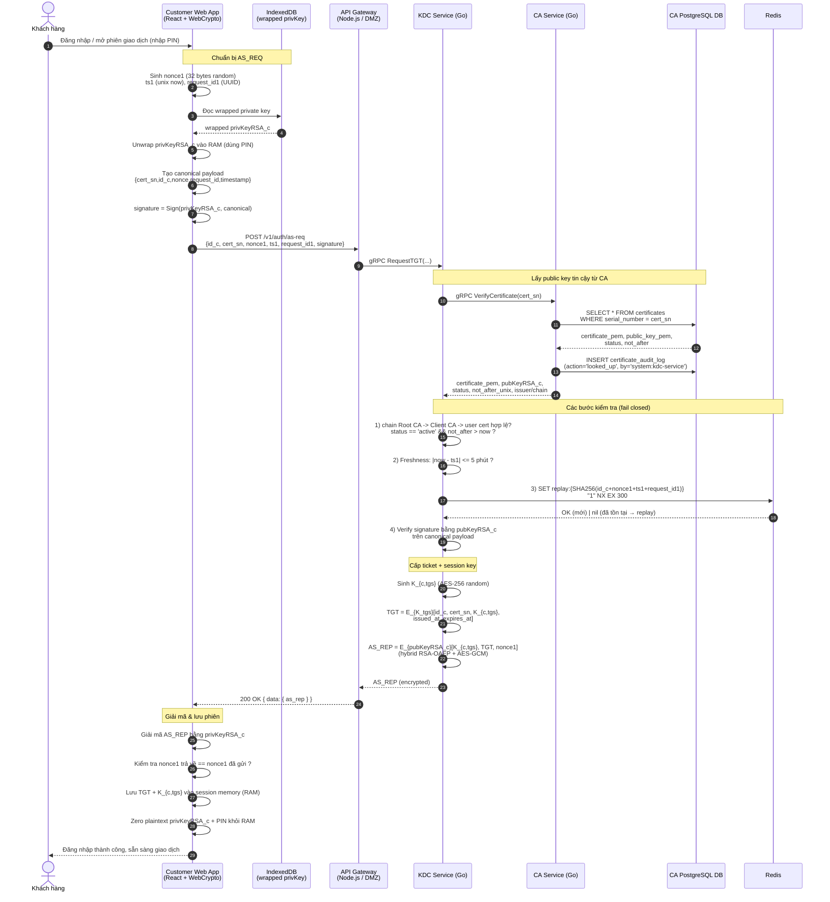
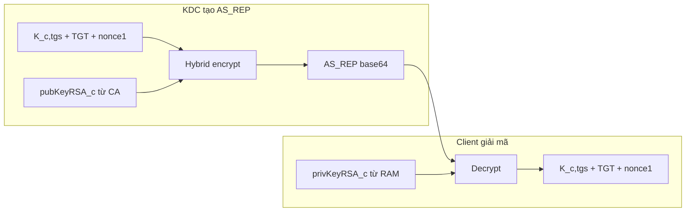

# AS Exchange Flow — Giải thích chi tiết

> Tài liệu này diễn giải **Phase 2 — AS Exchange** (Authentication Service Exchange) của Mini-Banking-App.
> Nguồn: `blueprint/specs/02-as-exchange.md`, `blueprint/api-design/02-as-exchange.md`,
> `blueprint/design.md` (Flow 2 + Key Model), `blueprint/database-design.md`.

---

## 1. AS Exchange là gì và để làm gì?

Sau khi khách hàng đã đăng ký (Phase 1) và có sẵn:
- **Private key** (`privKeyRSA_c`) trong IndexedDB của trình duyệt (dạng wrapped).
- **X.509 certificate** (`X.509_c`) do Client CA cấp, đã lưu cả ở client và CA DB.

AS Exchange là bước **đăng nhập / mở phiên giao dịch**. Mục tiêu:

1. Client **chứng minh danh tính** với KDC bằng cách **ký số** AS_REQ (chỉ chủ private key mới ký được).
2. KDC **không tin** public key gửi kèm — nó lấy public key thật từ **CA Service** dựa trên `cert_sn`.
3. Nếu hợp lệ, KDC cấp:
   - **TGT** (Ticket-Granting Ticket) — vé "thông hành", được mã hóa bằng khóa bí mật của KDC (`K_tgs`) nên client **không đọc được nội dung**, chỉ giữ và xuất trình lại ở Phase 3.
   - **`K_{c,tgs}`** — session key dùng chung giữa client và KDC cho bước TGS Exchange tiếp theo.

Kết quả: client có `TGT` + `K_{c,tgs}` trong **RAM** (không persist), sẵn sàng cho Phase 3 (TGS Exchange).

---

## 2. Sơ đồ luồng (Sequence Diagram)



---

## 3. Sơ đồ quyết định (các nhánh lỗi)

```mermaid
flowchart TD
    A[Nhận AS_REQ tại KDC] --> B{Cert tồn tại<br/>trong CA DB?}
    B -- Không --> E1[401 UNAUTHORIZED]
    B -- Có --> C{status=active<br/>& chưa hết hạn?}
    C -- Không (revoked/expired) --> E1
    C -- Có --> D{|now - ts1|<br/>&le; 5 phút?}
    D -- Không --> E2[401 STALE_REQUEST]
    D -- Có --> F{Nonce mới?<br/>SET NX thành công?}
    F -- Không (đã dùng) --> E3[401 REPLAY_DETECTED]
    F -- Có --> H{Signature hợp lệ<br/>với pubKeyRSA_c?}
    H -- Không --> E4[401 INVALID_SIGNATURE]
    H -- Có --> I[Sinh K_c,tgs + TGT<br/>Trả AS_REP 200 OK]

    CAERR{CA Service<br/>không khả dụng?} -. bất kỳ lúc nào .-> E5[503 SERVICE_UNAVAILABLE]

    style I fill:#1b5e20,color:#fff
    style E1 fill:#7f1d1d,color:#fff
    style E2 fill:#7f1d1d,color:#fff
    style E3 fill:#7f1d1d,color:#fff
    style E4 fill:#7f1d1d,color:#fff
    style E5 fill:#7f1d1d,color:#fff
```

> **Nguyên tắc**: response lỗi ra ngoài **không tiết lộ lý do nội bộ chi tiết** (không phân biệt
> "cert not found" vs "invalid signature" cho attacker). Các mã `STALE_REQUEST` / `REPLAY_DETECTED`
> tách riêng chủ yếu để client/test hiểu, còn audit chi tiết ghi nội bộ.

---

## 4. Các khóa và certificate dùng trong AS Exchange

Bảng dưới chỉ liệt kê các thành phần mật mã **thực sự xuất hiện** trong AS Exchange.

| Thành phần | Loại | Ai cấp / sinh | Lưu ở đâu | Dùng làm gì trong AS Exchange |
|---|---|---|---|---|
| `privKeyRSA_c` | Private key (RSA/ECDSA) của khách hàng | Sinh ở browser (WebCrypto) tại Phase 1 | **IndexedDB** dạng *wrapped*; unwrap vào **RAM** khi dùng | (1) **Ký** canonical AS_REQ → `signature`. (2) **Giải mã** AS_REP (RSA-OAEP) để lấy `K_{c,tgs}` + TGT. Plaintext key bị **xóa khỏi RAM** sau khi xong. |
| `pubKeyRSA_c` | Public key của khách hàng | Sinh cùng cặp với private key (Phase 1) | Nằm trong `X.509_c`; lưu cột `public_key_pem` ở **CA DB** | KDC dùng để **verify signature** AS_REQ và để **wrap (mã hóa) AS_REP** gửi về client. KDC **luôn lấy từ CA**, không tin key gửi trong request. |
| `X.509_c` (cert khách hàng) | Certificate X.509 | **Client CA** ký từ CSR (Phase 1), Client CA được Root CA ký | Client + **CA DB** (`certificates`) | Nguồn tin cậy ràng buộc `pubKeyRSA_c` ↔ danh tính `id_c`. KDC tra qua `cert_sn` để lấy `pubKeyRSA_c`, kiểm tra issuer chain, `status` và `not_after`. |
| `client-ca.crt` / `client-ca.key` | Intermediate CA cho user/client cert | Root CA ký trong provisioning | CA Service giữ private key; public cert nằm trong trust bundle/metadata | Ký `X.509_c` từ CSR. Không dùng để ký cert TLS service nội bộ. |
| `root-ca.crt` | Trust anchor cao nhất | Root CA self-signed | **Pinned** trong client & config các service | Verify chain Root CA → Client CA → `X.509_c` để chống public-key substitution. |
| `K_tgs` | Symmetric key (AES-256) — khóa **chỉ KDC biết** | Provisioning local/demo | Env/file secret của **KDC Service** | KDC **mã hóa TGT** bằng `K_tgs`. Vì client không có key này nên **không đọc/sửa được TGT** — TGT là "opaque" với client. Sẽ được KDC giải mã lại ở Phase 3. |
| `K_{c,tgs}` | Symmetric session key (AES-256) | **KDC sinh** ngay trong AS Exchange | Client: **session memory (RAM)**; KDC: nhúng trong TGT (mã hóa bằng `K_tgs`), không lưu DB | Session key dùng chung giữa client ↔ KDC cho **TGS Exchange (Phase 3)**: mã hóa/giải mã Authenticator & TGS_REP. TTL theo TGT (15–30 phút). |
| `privKeyRSA_kdc` / `pubKeyRSA_kdc` | Cặp khóa ký response của KDC (tùy chọn) | Provisioning | KDC giữ private; client/config giữ public | Tùy chọn: nếu flow yêu cầu KDC **ký AS_REP** để client verify nguồn gốc. Cơ chế xác thực KDC tối thiểu ở đây là *chỉ chủ `privKeyRSA_c` mới giải mã được AS_REP*. |

### Cách "cuộn" khóa trong AS_REP (hybrid encryption)



- **RSA-OAEP** wrap session key `K_{c,tgs}`; **AES-256-GCM** mã hóa phần payload lớn (TGT). Tránh dùng RSA trực tiếp cho dữ liệu lớn.
- Chỉ ai giữ `privKeyRSA_c` mới mở được AS_REP ⇒ đây chính là cách KDC "chứng minh ngược" rằng response đến đúng client hợp lệ, đồng thời `nonce1` khớp chống replay/MITM phía response.

---

## 5. Vai trò TGT vs K_{c,tgs} (dễ nhầm)

| | TGT | `K_{c,tgs}` |
|---|---|---|
| Bản chất | Vé mã hóa bằng `K_tgs` | Session key AES-256 |
| Client đọc được nội dung? | **Không** (opaque) | **Có** (dùng trực tiếp) |
| Ai giải mã được TGT? | Chỉ KDC (có `K_tgs`) | — |
| Chứa gì | `id_c, cert_sn, K_{c,tgs}, issued_at, expires_at` | (chính nó là key) |
| Dùng ở đâu | Xuất trình lại ở **TGS Exchange** | Mã hóa Authenticator/TGS_REP ở **TGS Exchange** |
| Lưu ở đâu | Client RAM | Client RAM |
| TTL | 15–30 phút | Theo TGT |

> Cùng một `K_{c,tgs}` tồn tại ở **hai nơi**: (1) trong RAM client (lấy từ AS_REP), (2) bên trong TGT đã mã hóa. Ở Phase 3, KDC giải mã TGT bằng `K_tgs` để lấy lại `K_{c,tgs}` mà không cần lưu state — đây là tính chất **stateless ticket** của Kerberos.

---

## 6. Cơ chế chống tấn công áp dụng tại bước này

| Tấn công | Cơ chế phòng thủ | Vị trí |
|---|---|---|
| Mạo danh / không có private key | Bắt buộc ký AS_REQ bằng `privKeyRSA_c`; KDC verify bằng `pubKeyRSA_c` từ cert | Client + KDC |
| Public-key substitution | KDC **không nhận raw public key** từ request; luôn lấy từ CA và verify chain Root CA → Client CA → user cert | KDC + CA |
| Replay AS_REQ | `nonce1 + ts1 + request_id1` → `SET replay:{hash} NX EX 300` (Redis) | KDC + Redis |
| Clock-skew / stale | Freshness window `|now - ts1| ≤ 5 phút` | KDC |
| Cert đã thu hồi/hết hạn | Kiểm tra `status='active'` & `not_after > now` từ CA | KDC + CA |
| MITM trên response | AS_REP mã hóa bằng `pubKeyRSA_c` + chứa `nonce1`; chỉ client thật giải mã & khớp được | Client + KDC |
| Lộ key trong RAM | Zero plaintext `privKeyRSA_c` + PIN sau khi dùng; `K_{c,tgs}` chỉ ở RAM, không persist | Client |

> **Lưu ý đồng bộ TTL**: replay cache TTL = 300s = freshness window = 5 phút. Khớp nhau để không tạo khoảng trống mà nonce hết hạn cache nhưng request vẫn còn "fresh".

---

## 7. Dữ liệu đụng tới (database / cache)

| Bảng / Key | Store | Thao tác trong AS Exchange |
|---|---|---|
| `certificates` | CA DB | `SELECT` theo `serial_number` để lấy `public_key_pem`, `status`, `not_after` |
| `certificate_audit_log` | CA DB | `INSERT action='looked_up', performed_by='system:kdc-service'` |
| `replay:{SHA-256(id_c+nonce1+ts1+request_id1)}` | Redis | `SET ... "1" NX EX 300` — atomic check-and-set chống replay |

> AS Exchange **không ghi gì vào Bank DB**. Nó chỉ đọc certificate (CA DB) + ghi nonce (Redis) + audit lookup. TGT/`K_{c,tgs}` không lưu DB ở bất kỳ đâu (stateless).

---

## 8. Tóm tắt một câu

> Client **ký** AS_REQ bằng `privKeyRSA_c` → KDC lấy `pubKeyRSA_c` thật từ user cert do **Client CA** ký thông qua CA Service để **verify**, kiểm tra chain/status/freshness/replay → cấp **TGT** (khóa bằng `K_tgs` nội bộ KDC) và **`K_{c,tgs}`**, gói trong AS_REP **mã hóa bằng `pubKeyRSA_c`** → chỉ client thật giải mã được, lưu vào RAM để bước TGS Exchange dùng tiếp.
