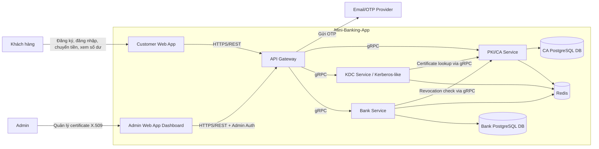
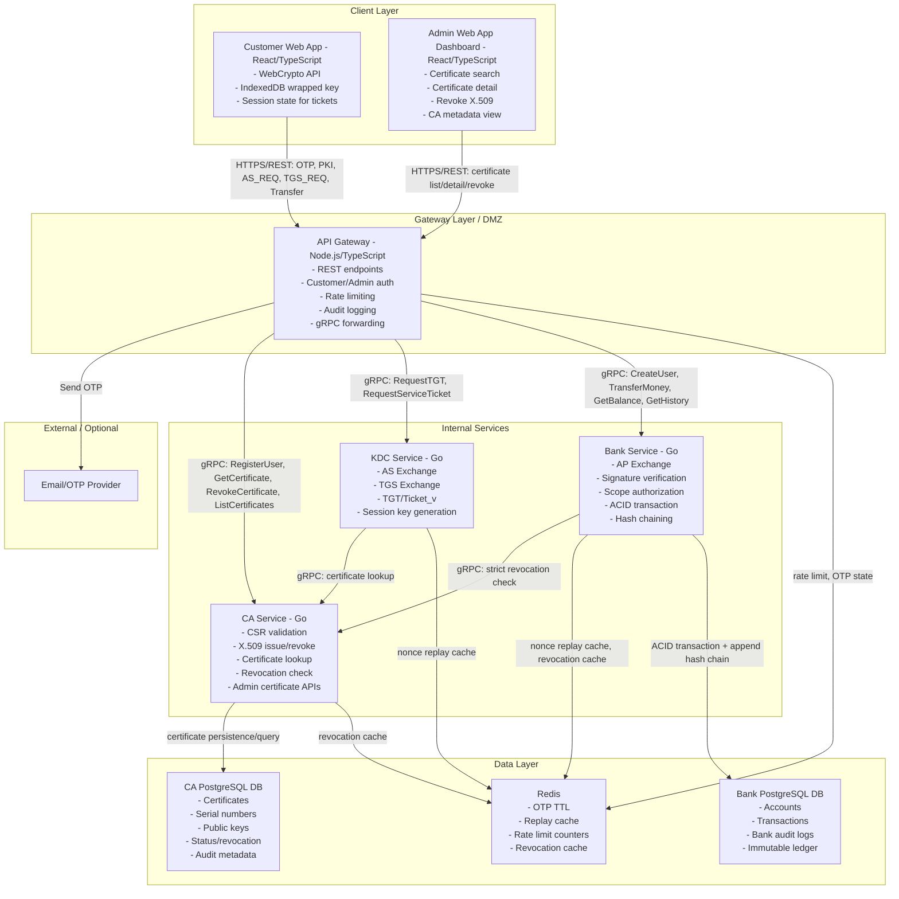
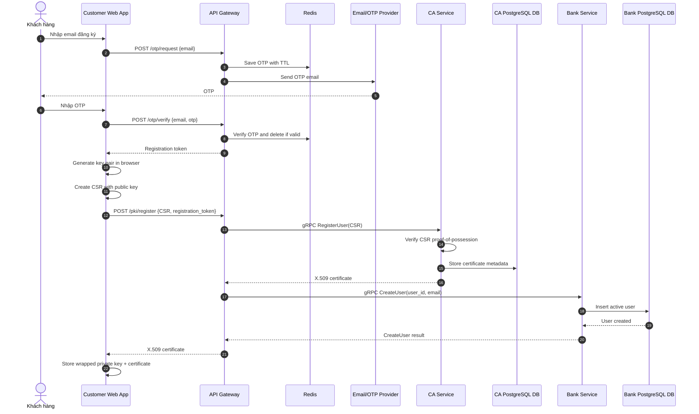
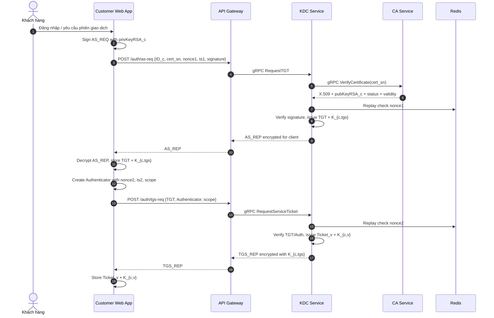
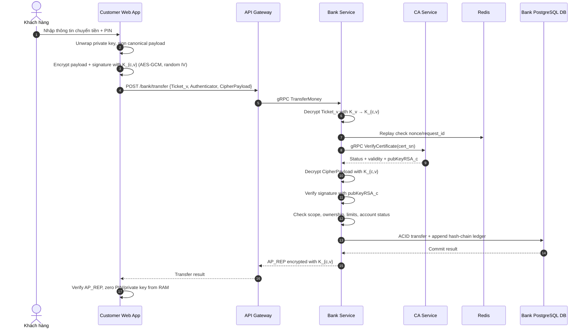
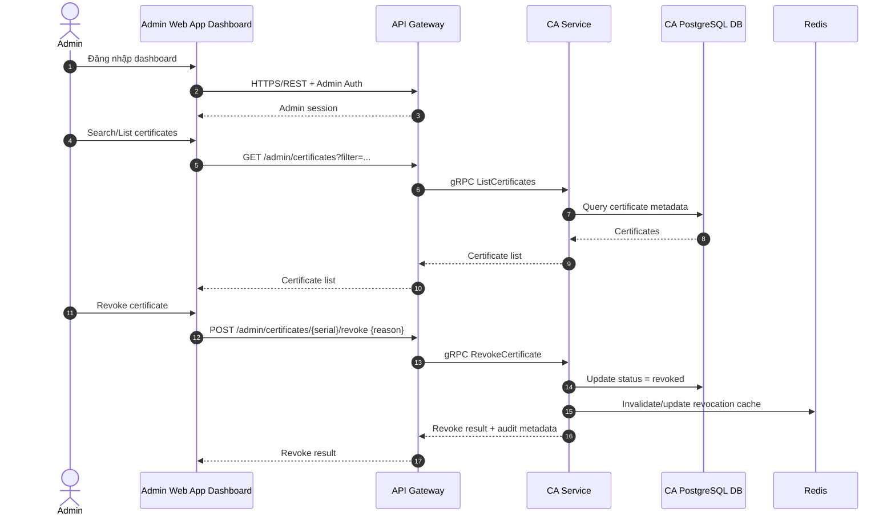

# Mini-Banking-App - Technical Design

## Kiến trúc tổng thể

**Kiến trúc chính: Layered Service Architecture với gRPC Internal Communication.**

Mini-Banking-App là hệ thống ngân hàng số mô phỏng, tập trung vào luồng xác thực và giao dịch bảo mật nhiều lớp. Hệ thống được chia thành các lớp rõ ràng: Client, Admin Dashboard, Gateway/DMZ, Internal Services và Data Layer. Các service nội bộ giao tiếp bằng gRPC; network isolation (Docker internal network) giới hạn caller hợp lệ, không dùng mTLS.

Luồng bảo mật chính gồm 4 phase:

| Phase | Mục đích | Thành phần chính |
|---|---|---|
| Phase 1 - OTP & PKI Registration | Xác minh email, tạo khóa client, cấp chứng chỉ X.509 và tạo Bank user | Customer Web App, API Gateway, CA Service, Bank Service, CA DB, Bank DB, Redis |
| Phase 2 - AS Exchange | Xác thực ban đầu và cấp TGT + `K_{c,tgs}` | Customer Web App, API Gateway, KDC Service, CA Service, Redis |
| Phase 3 - TGS Exchange | Cấp `Ticket_v` và `K_{c,v}` theo scope | Customer Web App, API Gateway, KDC Service, Redis |
| Phase 4 - AP Exchange & Transaction | Xác thực giao dịch, kiểm tra chữ ký, authorization và ghi ledger | Customer Web App, API Gateway, Bank Service, CA Service, Bank DB, Redis |
| Admin Certificate Management | Quản lý, tra cứu và revoke chứng chỉ X.509 | Admin Web App Dashboard, API Gateway, CA Service, CA DB |

### Các thành phần chính

| Thành phần | Công nghệ | Vai trò |
|---|---|---|
| Customer Web App | React + TypeScript | Giao diện cho Khách hàng; sinh khóa RSA bằng WebCrypto API; lưu wrapped private key trong IndexedDB; giữ ticket/session key trong RAM |
| Admin Web App Dashboard | React + TypeScript | Giao diện cho Admin quản lý PKI/CA; tra cứu certificate, xem trạng thái X.509, revoke certificate và xem certificate metadata |
| API Gateway | Node.js + TypeScript | Lớp DMZ nhận REST API từ Customer Web App và Admin Dashboard; rate limiting; verify auth; audit logging; forward request vào internal services qua gRPC |
| CA Service | Go | Certificate Authority; xử lý CSR; cấp phát X.509; tra cứu certificate; kiểm tra/thu hồi chứng chỉ; cung cấp dữ liệu certificate đầy đủ cho Admin Dashboard |
| KDC Service | Go | Kerberos-like Key Distribution Center; xử lý AS Exchange và TGS Exchange; cấp TGT, `Ticket_v` và session key; stateless ticket |
| Bank Service | Go | Xử lý AP Exchange; giải mã `Ticket_v`; xác minh chữ ký giao dịch; kiểm tra scope/ownership/limit/status; thực hiện ACID transaction và Hash Chaining |
| CA PostgreSQL DB | PostgreSQL | Database riêng của CA Service; lưu certificate, certificate serial, subject, public key, status, issued/expired/revoked timestamp và audit metadata |
| Bank PostgreSQL DB | PostgreSQL | Database riêng cho Bank Service; lưu tài khoản, giao dịch, bank audit log và immutable ledger |
| Redis | In-memory store | Lưu OTP TTL ngắn, replay cache cho nonce, rate limit counters và revocation cache |
| Proto/PB Package | Protocol Buffers + gRPC | Định nghĩa contract nội bộ giữa Gateway, CA, KDC và Bank Service |

### Cách các thành phần giao tiếp với nhau

| Luồng | Giao tiếp | Mô tả |
|---|---|---|
| Khách hàng -> Customer Web App | Browser UI | Khách hàng đăng ký, đăng nhập, xem số dư/lịch sử và thực hiện chuyển tiền |
| Admin -> Admin Web App Dashboard | Browser UI | Admin quản lý certificate X.509, tra cứu trạng thái và revoke certificate |
| Customer Web App -> API Gateway | HTTPS/REST | Client gọi các endpoint public như OTP, PKI register, AS_REQ, TGS_REQ, transfer |
| Admin Dashboard -> API Gateway | HTTPS/REST + Admin Auth | Dashboard gọi endpoint quản trị certificate, revocation và certificate search |
| API Gateway -> CA Service | gRPC | Gateway gửi CSR để CA cấp certificate; Admin Dashboard request danh sách/trạng thái/revoke certificate thông qua Gateway |
| API Gateway -> KDC Service | gRPC | Gateway forward AS_REQ/TGS_REQ; KDC trả AS_REP/TGS_REP cho client thông qua Gateway |
| API Gateway -> Bank Service | gRPC | Gateway forward request Bank, đọc số dư/lịch sử và tạo user sau PKI enrollment |
| KDC Service -> CA Service | gRPC | KDC lấy certificate/public key để xác minh pre-authentication signature |
| Bank Service -> CA Service | gRPC | Bank Service kiểm tra trạng thái thu hồi chứng chỉ trước khi xử lý giao dịch |
| CA Service -> CA PostgreSQL DB | TCP nội bộ | CA lưu và truy vấn certificate metadata để phục vụ cấp phát, revoke, lookup và Admin Dashboard |
| Services -> Redis | TCP nội bộ | Lưu OTP, nonce replay cache, rate limit và revocation cache |
| Bank Service -> Bank PostgreSQL DB | TCP nội bộ | Thực hiện transaction ACID và append immutable ledger bằng hash chaining |

Luồng giao dịch bảo mật tóm tắt:

1. Khách hàng đăng ký bằng OTP, tạo cặp khóa ở browser và gửi CSR lên hệ thống.
2. CA Service xác minh CSR, cấp chứng chỉ X.509 và lưu certificate metadata vào CA PostgreSQL DB.
3. API Gateway gọi Bank Service tạo user record tương ứng; nếu tạo user thất bại thì certificate vừa cấp phải bị revoke/mark failed.
4. Customer Web App dùng private key để ký AS_REQ; KDC xác minh chữ ký qua certificate lấy từ CA Service và cấp TGT.
5. Customer Web App dùng TGT để xin `Ticket_v` theo scope cụ thể từ KDC.
6. Customer Web App ký payload giao dịch bằng private key, mã hóa payload bằng `K_{c,v}` và gửi `Ticket_v` đến Bank Service.
7. Bank Service giải mã ticket, kiểm tra replay, verify certificate qua CA Service, xác minh chữ ký, kiểm tra authorization rồi ghi giao dịch vào Bank PostgreSQL DB kèm hash chain.
8. Admin dùng Admin Dashboard để tra cứu certificate, xem trạng thái và revoke X.509 khi cần; mọi thao tác đi qua API Gateway và CA Service.

### Lý do lựa chọn kiến trúc

| Lý do | Giải thích |
|---|---|
| Tách ranh giới bảo mật rõ ràng | CA, KDC và Bank Service có vai trò mật mã khác nhau, nên tách service giúp giảm phạm vi ảnh hưởng khi một service gặp lỗi |
| Hỗ trợ hai nhóm người dùng đúng phạm vi | Khách hàng dùng Customer Web App cho giao dịch; Admin dùng Admin Web App Dashboard riêng để quản lý certificate X.509 |
| Phù hợp với luồng PKI + Kerberos-like | KDC cấp ticket/session key, CA cấp certificate, Bank Service xử lý giao dịch; kiến trúc layered phản ánh đúng trách nhiệm của từng thành phần |
| Giao tiếp nội bộ chặt chẽ | gRPC + protobuf định nghĩa contract rõ ràng và type-safe; network isolation giới hạn caller hợp lệ |
| CA có dữ liệu quản trị đầy đủ | CA PostgreSQL DB riêng giúp lưu certificate metadata, trạng thái revocation và dữ liệu cần thiết cho Admin Dashboard |
| Giảm phụ thuộc vào token dài hạn | Ticket ngắn hạn, có scope và session key riêng giúp hạn chế rủi ro nếu token/key bị lộ |
| Dễ demo và kiểm thử theo phase | Có thể kiểm thử riêng OTP/PKI, AS Exchange, TGS Exchange, AP Exchange và Admin Certificate Management trước khi nối end-to-end |
| Bảo vệ toàn vẹn dữ liệu giao dịch | Bank Service là điểm xử lý ACID chính, đồng thời ghi immutable ledger bằng hash chaining |
| Giữ đúng nguyên tắc Zero-Knowledge | Private key sinh và dùng ở client; server chỉ nhận public key/certificate và chữ ký để xác minh |

---

## Key Model & Key Lifecycle

| Khóa / Bí mật | Owner | Sinh ở đâu | Lưu ở đâu | Mục đích | Lifetime / Chính sách |
|---|---|---|---|---|---|
| `privKeyRSA_c` | Khách hàng | Customer Web App bằng WebCrypto API | IndexedDB dưới dạng wrapped key; khi dùng thì unwrap trong RAM | Ký CSR, AS_REQ và payload giao dịch | Dài hạn theo thiết bị; plaintext private key không rời browser và bị xóa khỏi RAM sau khi dùng |
| `pubKeyRSA_c` | Khách hàng | Customer Web App | Gửi trong CSR, lưu trong X.509 certificate và CA DB | Xác minh chữ ký của khách hàng | Dài hạn theo certificate; thay đổi khi cấp lại chứng chỉ |
| `X.509_c` | Khách hàng / CA | CA Service ký từ CSR | Customer Web App, CA PostgreSQL DB | Ràng buộc `pubKeyRSA_c` với danh tính khách hàng | Có `not_before`, `not_after`, serial và revocation status |
| `privKeyRSA_ca` | CA Service | Provisioning local/demo | Env/file secret trong demo; production sẽ dùng KMS/HSM | Ký certificate X.509 | Dài hạn; không đưa vào code; có kế hoạch rotation trong production |
| `pubKeyRSA_ca` | Toàn hệ thống | Provisioning local/demo | Trust anchor/pinned root public key trong client và service config | Verify certificate chain và chống public-key substitution | Dài hạn; rotation cần migration trust anchor |
| `privKeyRSA_kdc` | KDC Service | Provisioning local/demo | Env/file secret trong demo | Ký response của KDC nếu flow yêu cầu signature trên AS_REP/TGS_REP | Dài hạn; không đưa vào code; rotation theo cấu hình |
| `pubKeyRSA_kdc` | Customer Web App / Gateway | Provisioning local/demo | Client/service config | Verify response của KDC khi có signature | Dài hạn; có thể pin hoặc phân phối qua config tin cậy |
| `K_tgs` | KDC Service | Provisioning local/demo | Env/file secret trong KDC | Mã hóa/giải mã TGT | Dài hạn ở mức demo; production cần rotation và key version |
| `K_v` | Bank Service | Provisioning local/demo | Env/file secret trong Bank Service | Mã hóa/giải mã `Ticket_v` | Dài hạn ở mức demo; production cần rotation và key version |
| `K_{c,tgs}` | Customer Web App + KDC | KDC sinh trong AS Exchange | Customer session memory; không lưu DB | Session key giữa client và TGS | Theo TGT, đề xuất 15-30 phút |
| `K_{c,v}` | Customer Web App + Bank Service | KDC sinh trong TGS Exchange | Customer session memory; nằm trong `Ticket_v` mã hóa bằng `K_v` | Service session key giữa client và Bank Service | Theo `Ticket_v`, đề xuất 5-10 phút |
| OTP | Gateway / Redis | API Gateway sinh | Redis với TTL ngắn | Xác thực email ban đầu | 2-5 phút, dùng một lần |

## Cryptographic Algorithms

| Nhu cầu | Thuật toán / Cơ chế đề xuất | Ghi chú triển khai |
|---|---|---|
| Sinh và dùng khóa client | WebCrypto API, RSA-PSS hoặc ECDSA P-256 cho chữ ký | Nếu dùng RSA, ưu tiên RSA-PSS cho signing; private key đặt `extractable: false` khi có thể |
| Ký CSR và giao dịch | RSA-PSS/SHA-256 hoặc ECDSA/SHA-256 | Payload cần canonical hóa trước khi ký để tránh sai lệch dữ liệu khi verify |
| Mã hóa dữ liệu đối xứng | AES-256-GCM | Mỗi lần mã hóa phải dùng IV/nonce 96-bit duy nhất; không reuse IV với cùng key |
| Mã hóa session key cho client | Hybrid encryption: RSA-OAEP để wrap AES/session key, AES-GCM cho payload lớn | Tránh dùng RSA trực tiếp cho payload lớn |
| Mã hóa ticket | AES-256-GCM với `K_tgs` hoặc `K_v` | Ticket cần chứa key version, issued_at, expires_at, scope và nonce/session id |
| Hash chain ledger | SHA-256 | `Hash_n = SHA-256(previous_hash + canonical_payload + signature + metadata)` |
| Replay cache key | SHA-256 | Hash từ `ID_c`, nonce, timestamp, service id và request id; lưu Redis bằng `SET NX EX` |
| Transport internal | gRPC | Network isolation (Docker internal network) bảo vệ internal traffic; không dùng mTLS |

## Trust Model & Public Key Distribution

| Điểm tin cậy | Thiết kế |
|---|---|
| CA là trust anchor | Client, Gateway, KDC và Bank Service chỉ tin public key của người dùng nếu public key nằm trong certificate X.509 hợp lệ do CA ký |
| Phân phối CA public key | `pubKeyRSA_ca` được pin trong Customer Web App/Admin Dashboard hoặc cấu hình tin cậy khi build/deploy |
| Chống public-key substitution | KDC và Bank Service không nhận public key raw từ request làm nguồn tin cậy; luôn lấy public key từ certificate/CA Service và verify certificate chain |
| Chống MITM nội bộ | Gateway, CA, KDC và Bank Service giao tiếp bằng gRPC trong Docker internal network; network isolation giới hạn caller hợp lệ |
| Chống MITM phía client | Client gọi Gateway qua HTTPS; response quan trọng của KDC/Bank có nonce/timestamp và có thể được ký hoặc mã hóa bằng key chỉ client hợp lệ giải mã được |
| Revocation trust | Bank Service bắt buộc kiểm tra revocation qua CA Service hoặc revocation cache TTL ngắn trước khi chấp nhận giao dịch |
| Admin trust | Admin Dashboard không gọi trực tiếp CA Service; mọi thao tác quản trị đi qua Gateway, Admin Auth và audit logging |

## Mutual Authentication & Replay Prevention

| Cơ chế | Thiết kế |
|---|---|
| Client chứng minh danh tính với KDC | Client ký AS_REQ bằng `privKeyRSA_c`; KDC lấy `pubKeyRSA_c` từ certificate hợp lệ để verify |
| KDC chứng minh response hợp lệ | AS_REP/TGS_REP chứa nonce gốc của client và được mã hóa bằng key mà chỉ client hợp lệ đọc được; có thể thêm chữ ký KDC để client verify |
| Client chứng minh danh tính với Bank Service | Client gửi `Ticket_v`, Authenticator và payload đã ký số; Bank Service giải mã ticket để lấy `K_{c,v}` và verify chữ ký bằng `pubKeyRSA_c` |
| Bank Service chứng minh danh tính với client | Bank Service trả `AP_REP = E_{K_{c,v}}[Result, TS+1, request_id]`; chỉ Bank Service có `K_v` mới lấy được `K_{c,v}` từ `Ticket_v` |
| Chống replay | AS_REQ, TGS_REQ và AP_REQ đều có nonce + timestamp + request id; KDC/Bank lưu replay cache bằng Redis `SET NX EX` |
| Freshness window | Đề xuất `|now - TS| <= 5 phút`; request ngoài cửa sổ thời gian bị reject |
| Idempotency | Giao dịch chuyển tiền cần `idempotency_key` để tránh xử lý trùng khi client retry hợp lệ |

## Ticket Reuse Policy

| Ticket | Reuse policy | Lý do |
|---|---|---|
| TGT | Reusable trong TTL để xin nhiều `Ticket_v` | Giảm việc phải thực hiện AS Exchange nhiều lần; vẫn an toàn vì TGT được mã hóa bằng `K_tgs` và có lifetime ngắn |
| `Ticket_v` | Reusable trong TTL cho cùng `service_id` và `scope` | Phù hợp mô hình Kerberos; client có thể gọi nhiều API cùng scope mà không xin ticket lại |
| `Ticket_v` cho transfer | Có thể reusable trong TTL, nhưng mỗi giao dịch phải có nonce/timestamp/request id/idempotency key riêng | Chống replay và chống double-spend dù ticket được dùng lại |
| One-time mode | Với giao dịch nhạy cảm, Bank Service có thể đánh dấu `(ticket_id, request_id)` là used | Tăng bảo mật cho transfer giá trị cao hoặc demo nâng cao |
| Ticket expiry | TGT đề xuất 15-30 phút; `Ticket_v` đề xuất 5-10 phút | Giảm tác động nếu session key/ticket bị lộ |
| Ticket scope | Scope nằm trong `Ticket_v`, ví dụ `balance:read`, `transfer:create`, `history:read` | Bank Service reject nếu scope không khớp API hoặc account ownership |

## Session/Subsession Key Policy

| Key | Vai trò | Chính sách |
|---|---|---|
| `K_{c,tgs}` | Session key giữa client và KDC/TGS | Chỉ dùng để mã hóa TGS_REQ/TGS_REP; xóa khỏi session khi TGT hết hạn hoặc logout |
| `K_{c,v}` | Service session key giữa client và Bank Service | Chỉ dùng trong phạm vi `Ticket_v`; không lưu persistent storage |
| AES-GCM IV | Nonce mã hóa đối xứng | Unique cho từng encryption với `K_{c,v}`; dùng IV 96-bit random; không được reuse với cùng key |
| Cleanup | Xóa dữ liệu nhạy cảm | Sau khi hoàn tất request, client xóa plaintext private key và PIN khỏi RAM; sau khi logout/hết hạn thì xóa `K_{c,tgs}`, `K_{c,v}`, TGT và `Ticket_v` |

## PKI Admin Dashboard Scope

| Chức năng | Mô tả | Ghi chú bảo mật |
|---|---|---|
| List certificates | Admin xem danh sách certificate đã cấp | Phân trang, filter theo status/subject/serial |
| Certificate detail | Xem serial, subject, public key fingerprint, issued_at, expires_at, status, revocation reason | Không hiển thị private key vì CA không giữ private key của khách hàng |
| Revoke certificate | Thu hồi certificate theo serial | Bắt buộc Admin Auth, audit log và reason |
| Revocation status | Xem `valid`, `revoked`, `expired` | Bank Service dùng trạng thái này để strict revocation check |
| Search certificate | Tìm theo email/user id/serial/fingerprint | Chỉ trả dữ liệu metadata cần thiết |
| Admin audit log | Ghi lại thao tác cấp/thu hồi/tra cứu nhạy cảm | Phục vụ truy vết khi có tranh chấp |
| CA DB backing | Dữ liệu dashboard lấy từ CA PostgreSQL DB | CA DB là nguồn dữ liệu chính cho certificate metadata |

---

## Thiết kế kiểm soát truy cập

Phần này gom các luật authorization ở mức hệ thống. Các cơ chế mật mã như certificate, ticket và session key đã được mô tả ở các phần trước; ở đây chỉ tập trung vào ai được gọi API nào, với điều kiện gì.

### Actor và vùng truy cập

| Actor / Caller | Entry point | Quyền truy cập chính | Không được phép |
|---|---|---|---|
| Khách hàng | Customer Web App -> API Gateway | Đăng ký OTP/PKI, lấy ticket, xem số dư/lịch sử của chính mình, tạo giao dịch theo scope hợp lệ | Truy cập dữ liệu tài khoản người khác, gọi API Admin, gọi trực tiếp CA/KDC/Bank Service |
| Admin | Admin Web App Dashboard -> API Gateway | Tra cứu certificate, xem chi tiết certificate, revoke certificate X.509, xem audit metadata liên quan PKI | Thực hiện giao dịch thay khách hàng, đọc private key, gọi trực tiếp internal services |
| API Gateway | gRPC | Forward request đã xác thực vào CA, KDC, Bank Service | Bỏ qua validation/authz hoặc gọi API nội bộ ngoài service identity được cấp |
| KDC Service | gRPC | Lookup certificate từ CA để verify AS_REQ/TGS_REQ | Revoke certificate hoặc sửa CA DB |
| Bank Service | gRPC | Verify certificate từ CA, đọc/ghi Bank DB cho user, tài khoản và giao dịch hợp lệ | Truy cập CA DB trực tiếp hoặc cấp ticket |

### Authorization matrix

| Nhóm API | Caller hợp lệ | Điều kiện authorization | Kết quả khi không hợp lệ |
|---|---|---|---|
| `/otp/request`, `/otp/verify` | Khách hàng chưa đăng ký | Rate limit theo IP/email, OTP TTL hợp lệ | `429 Too Many Requests`, `400/401 Invalid OTP` |
| `/pki/register` | Khách hàng có registration token | JWT registration token hợp lệ, CSR proof-of-possession hợp lệ | Reject và ghi audit event |
| `/auth/as-req` | Khách hàng có X.509 | Certificate chưa revoked/expired, chữ ký AS_REQ hợp lệ, nonce chưa dùng | Reject, không cấp TGT |
| `/auth/tgs-req` | Khách hàng có TGT | TGT hợp lệ, scope requested hợp lệ, authenticator hợp lệ | Reject, không cấp `Ticket_v` |
| `/bank/accounts/{id}/balance/query`, `/bank/accounts/{id}/transactions/query` | Khách hàng có `Ticket_v` | Scope `balance:read` hoặc `history:read`, ownership khớp `ID_c` | `403 Forbidden` |
| `/bank/transfer` | Khách hàng có `Ticket_v` | Scope `transfer:create`, ownership, account status, daily limit, signature, revocation status | Reject trước khi ghi DB |
| `/admin/certificates` | Admin | Admin Auth hợp lệ, role `pki_admin` hoặc tương đương | `401/403` và audit event |
| `/admin/certificates/{serial}/revoke` | Admin | Admin Auth hợp lệ, reason bắt buộc, certificate tồn tại và chưa revoked | Reject hoặc idempotent no-op nếu đã revoked |

### Bank transaction authorization pipeline

1. Verify API Gateway caller bằng gRPC network isolation.
2. Giải mã `Ticket_v` bằng `K_v`, kiểm tra `service_id`, `scope`, `expires_at`.
3. Verify Authenticator bằng `K_{c,v}`, kiểm tra nonce/timestamp/request id.
4. Verify certificate qua CA Service hoặc revocation cache TTL ngắn để lấy status, validity và `pubKeyRSA_c`.
5. Verify chữ ký payload bằng `pubKeyRSA_c` từ certificate hợp lệ.
6. Kiểm tra ownership: `from_account.owner_id == ID_c`.
7. Kiểm tra business rules: tài khoản active, số dư đủ, daily limit, idempotency key chưa xử lý.
8. Chỉ khi toàn bộ bước trên pass mới mở DB transaction, lock `ledger_state` và append hash-chain ledger.

### Admin certificate authorization pipeline

1. Verify Admin Auth tại API Gateway.
2. Kiểm tra role/scope quản trị PKI, ví dụ `pki:read`, `pki:revoke`.
3. Forward sang CA Service bằng gRPC.
4. CA Service kiểm tra caller identity của Gateway và admin action metadata.
5. Với revoke, yêu cầu `reason`, `serial`, `requested_by`, timestamp.
6. Update CA DB, invalidate revocation cache và ghi audit log.

---

## Cơ chế bảo vệ hệ thống

Phần này mô tả các control vận hành và bảo vệ runtime. Các thuật toán chi tiết đã có trong `Cryptographic Algorithms`, còn phần này tập trung vào cách hệ thống giảm rủi ro trong luồng chạy thực tế.

| Rủi ro / Tấn công | Cơ chế bảo vệ | Vị trí áp dụng |
|---|---|---|
| Credential stuffing / spam OTP | Rate limiting theo IP/email, OTP TTL ngắn, OTP dùng một lần | API Gateway, Redis |
| Replay Attack | Nonce + timestamp + request id, Redis replay cache `SET NX EX` | KDC Service, Bank Service |
| MITM nội bộ | gRPC trong Docker internal network; network isolation giới hạn access | Gateway, CA, KDC, Bank |
| Public-key substitution | Chỉ tin public key trong X.509 do CA ký, verify chain bằng pinned CA public key | Customer Web App, KDC, Bank |
| Certificate bị thu hồi nhưng vẫn dùng | Strict revocation check trước giao dịch, revocation cache TTL ngắn | Bank Service, CA Service, Redis |
| Double transfer khi retry | Idempotency key cho transfer, unique constraint hoặc replay/idempotency store | API Gateway, Bank Service, Redis/Bank DB |
| Sửa dữ liệu giao dịch quá khứ | Append-only ledger, hash chaining, không update transaction lịch sử | Bank Service, Bank DB |
| Lộ dữ liệu nhạy cảm trong RAM | Memory zeroing cho PIN/private key/subsession key; ticket/session key TTL ngắn | Customer Web App |
| Gọi trực tiếp internal service | Docker internal network isolation; internal services không expose port ra ngoài | CA, KDC, Bank |
| Dữ liệu request sai schema | Validate request schema/protobuf, reject unknown/invalid fields | API Gateway, internal services |
| Service dependency lỗi | Timeout, retry tối đa 1 lần với lỗi network/transient, health check | API Gateway, internal services |
| Hành vi Admin nhạy cảm | Admin Auth, role/scope, audit log, reason bắt buộc khi revoke | Admin Dashboard, Gateway, CA |
| Lộ secret trong code | Secret qua env/file local demo, không commit private key, production đề xuất KMS/HSM | Service config |

### Error handling security rule

| Rule | Mô tả |
|---|---|
| Fail closed | Nếu không verify được certificate, ticket, signature, nonce hoặc revocation status thì reject request |
| Không tiết lộ bí mật qua lỗi | Response lỗi không trả private data, key material, raw ticket hoặc lý do nội bộ quá chi tiết |
| Audit event cho lỗi nhạy cảm | Ghi audit event cho replay detected, invalid signature, revoked certificate, admin revoke và transfer reject quan trọng |
| Retry có giới hạn | Chỉ retry với lỗi network/transient; không retry request đã fail vì auth, replay hoặc authorization |

---

## Các quyết định kỹ thuật quan trọng

| ADR | Quyết định | Lý do | Trade-off |
|---|---|---|---|
| ADR-01 | Layered Service Architecture với Gateway/DMZ và internal services | Tách rõ Customer/Admin UI, Gateway, CA, KDC, Bank và Data Layer | Phức tạp hơn monolith nhưng bảo mật và phân trách nhiệm tốt hơn |
| ADR-02 | Internal communication dùng gRPC, không dùng mTLS | Protobuf contract rõ ràng và type-safe; network isolation (Docker internal network) bảo vệ internal traffic mà không cần overhead provisioning service certificate | mTLS không áp dụng; bảo mật phụ thuộc vào network isolation — production nên thêm mTLS |
| ADR-03 | Zero-Knowledge private key bằng WebCrypto | Private key khách hàng sinh và dùng ở browser, server không giữ plaintext private key | Mất thiết bị/khóa có thể cần quy trình cấp lại certificate |
| ADR-04 | Certificate-based trust với X.509 và CA Service | Chống public-key substitution, hỗ trợ revocation và Admin PKI management | CA trở thành trust anchor quan trọng, cần bảo vệ khóa CA |
| ADR-05 | CA có PostgreSQL DB riêng | Lưu certificate metadata đầy đủ cho cấp phát, lookup, revoke và Admin Dashboard | Tăng thêm một datastore cần migration/backup |
| ADR-06 | Kerberos-like ticket flow thay JWT dài hạn | TGT/`Ticket_v` TTL ngắn, scope rõ, session key riêng cho service | Client phải thực hiện nhiều bước xác thực hơn |
| ADR-07 | `Ticket_v` reusable trong TTL nhưng request phải chống replay | Giữ đúng mô hình Kerberos và giảm số lần xin ticket | Cần nonce/timestamp/idempotency nghiêm ngặt cho transfer |
| ADR-08 | Không dùng `K_sub`; dùng `K_{c,v}` trực tiếp với AES-GCM random IV | `K_{c,v}` với IV ngẫu nhiên mỗi lần mã hóa đủ đảm bảo freshness; HKDF thêm phức tạp mà không tăng security thực sự trong phạm vi demo với TTL 5-10 phút | Nếu `K_{c,v}` bị lộ thì toàn bộ session bị ảnh hưởng; chấp nhận được vì TTL ngắn |
| ADR-09 | Bank Service là điểm ACID transaction duy nhất | Giảm distributed transaction, đảm bảo nhất quán số dư và ledger | Bank Service chịu trách nhiệm business validation nặng hơn |
| ADR-10 | Immutable ledger bằng Hash Chaining | Phát hiện sửa dữ liệu giao dịch quá khứ, tăng non-repudiation khi gắn chữ ký client | Không sửa lịch sử bằng update; lỗi nghiệp vụ cần reversal transaction |

---

## C4 Diagram

### Level 1 - System Context

### Level 2 - Container

---

## High-Level Diagram

### Các luồng quan trọng cần vẽ

| Luồng | Actor chính | Mục đích | Thành phần tham gia |
|---|---|---|---|
| Customer Registration & PKI Enrollment | Khách hàng | Xác minh OTP, sinh key pair, gửi CSR, nhận X.509 certificate và tạo Bank user | Customer Web App, API Gateway, Redis, CA Service, CA DB, Bank Service, Bank DB, Email/OTP Provider |
| Kerberos-like Authentication | Khách hàng | Lấy TGT, `K_{c,tgs}`, `Ticket_v` và `K_{c,v}` | Customer Web App, API Gateway, KDC Service, CA Service, Redis |
| Secure Banking Transaction | Khách hàng | Ký số payload, chống replay, kiểm tra revocation, authorization và ghi ledger | Customer Web App, API Gateway, Bank Service, CA Service, Redis, Bank DB |
| PKI Admin Certificate Management | Admin | Tra cứu, xem chi tiết và revoke chứng chỉ X.509 | Admin Web App Dashboard, API Gateway, CA Service, CA DB, Redis |
| Internal Trust & Service Communication | Hệ thống | Bảo vệ giao tiếp service-to-service bằng gRPC | API Gateway, CA Service, KDC Service, Bank Service |

### Flow 1 - Customer Registration & PKI Enrollment

### Flow 2 - Kerberos-like Authentication

### Flow 3 - Secure Banking Transaction

### Flow 4 - PKI Admin Certificate Management

