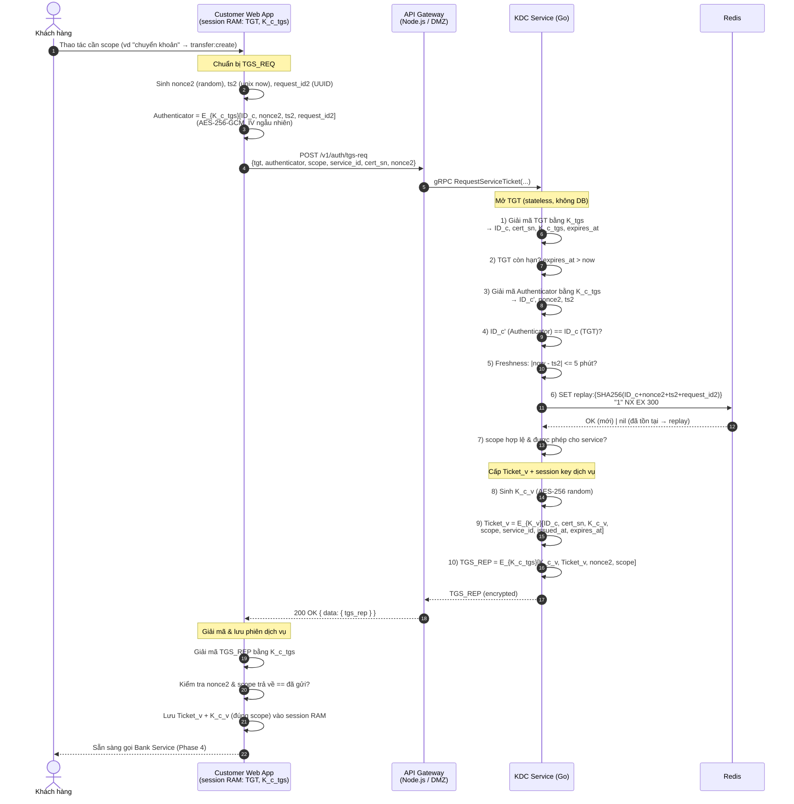
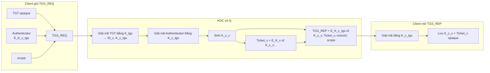

# TGS Exchange Flow — Giải thích chi tiết

> Tài liệu này diễn giải **Phase 3 — TGS Exchange** (Ticket-Granting Service Exchange) của Mini-Banking-App.
> Nguồn: `blueprint/specs/03-tgs-exchange.md`, `blueprint/api-design/03-tgs-exchange.md`,
> `blueprint/design.md` (Flow 2 + Key Model). Đọc kèm `blueprint/as-exchange-flow.md` (Phase 2) vì TGS dùng đầu ra của AS.

---

## 1. TGS Exchange là gì và để làm gì?

Sau AS Exchange (Phase 2), client đã có trong **RAM**:
- **TGT** — vé thông hành, opaque (mã hóa bằng `K_tgs` của KDC).
- **`K_{c,tgs}`** — session key dùng chung giữa client và KDC.

TGS Exchange là bước **đổi TGT lấy vé dịch vụ** cho một **scope** cụ thể (`balance:read`, `transfer:create`, `history:read`). Mục tiêu:

1. Client **chứng minh đang giữ `K_{c,tgs}`** bằng cách gửi **Authenticator** mã hóa bằng `K_{c,tgs}` (không cần ký số như AS — bí mật chia sẻ đối xứng là đủ).
2. KDC **giải mã TGT** bằng `K_tgs` để lấy lại danh tính `ID_c` + `K_{c,tgs}` (stateless — KDC không lưu session).
3. Nếu hợp lệ, KDC cấp:
   - **`Ticket_v`** — vé dịch vụ, mã hóa bằng **`K_v`** (khóa của Bank Service) → client **không đọc được**, chỉ xuất trình ở Phase 4 (AP Exchange).
   - **`K_{c,v}`** — session key dùng chung giữa client và **Bank Service**.

Kết quả: client có `Ticket_v` + `K_{c,v}` (đúng scope) trong RAM, sẵn sàng gọi Bank Service.

> Khác với AS Exchange: TGS Exchange **không gọi CA**, **không verify chữ ký số**, **không cần lookup certificate** lúc runtime. `cert_sn` trong TGT vẫn là serial của user certificate do Client CA cấp, nhưng TGS chỉ chuyển tiếp nó vào `Ticket_v`. Toàn bộ tin cậy runtime đến từ việc giải mã được TGT (`K_tgs`) và Authenticator (`K_{c,tgs}`).

---

## 2. Sơ đồ luồng (Sequence Diagram)



---

## 3. Sơ đồ quyết định (các nhánh lỗi)

```mermaid
flowchart TD
    A[Nhận TGS_REQ tại KDC] --> B{Giải mã TGT<br/>bằng K_tgs OK?}
    B -- Không (tampered/sai key) --> E1[401 INVALID_TICKET]
    B -- Có --> C{TGT còn hạn?<br/>expires_at > now}
    C -- Không --> E1b[401 INVALID_TICKET<br/>TGT Expired]
    C -- Có --> D{Giải mã Authenticator<br/>bằng K_c_tgs OK?}
    D -- Không --> E2[401 UNAUTHORIZED]
    D -- Có --> F{ID_c khớp giữa<br/>Authenticator & TGT?}
    F -- Không --> E2
    F -- Có --> G{|now - ts2|<br/>&le; 5 phút?}
    G -- Không --> E3[401 STALE_REQUEST]
    G -- Có --> H{Nonce2 mới?<br/>SET NX thành công?}
    H -- Không --> E4[401 REPLAY_DETECTED]
    H -- Có --> I{scope hợp lệ<br/>& được phép?}
    I -- Không --> E5[403 WRONG_SCOPE]
    I -- Có --> J[Sinh K_c_v + Ticket_v<br/>Trả TGS_REP 200 OK]

    KDCERR{KDC không<br/>khả dụng?} -. bất kỳ lúc nào .-> E6[503 SERVICE_UNAVAILABLE]

    style J fill:#1b5e20,color:#fff
    style E1 fill:#7f1d1d,color:#fff
    style E1b fill:#7f1d1d,color:#fff
    style E2 fill:#7f1d1d,color:#fff
    style E3 fill:#7f1d1d,color:#fff
    style E4 fill:#7f1d1d,color:#fff
    style E5 fill:#92400e,color:#fff
    style E6 fill:#7f1d1d,color:#fff
```

> `WRONG_SCOPE` là `403` (Forbidden — danh tính hợp lệ nhưng không đủ quyền), khác với nhóm `401` (xác thực thất bại).

---

## 4. Các khóa và ticket dùng trong TGS Exchange

Bảng dưới chỉ liệt kê các thành phần mật mã **thực sự xuất hiện** trong TGS Exchange.

| Thành phần | Loại | Ai cấp / sinh | Lưu ở đâu | Dùng làm gì trong TGS Exchange |
|---|---|---|---|---|
| **TGT** | Vé mã hóa bằng `K_tgs` | KDC cấp ở **AS Exchange** | Client **RAM**; gửi lại nguyên trạng trong TGS_REQ | Client xuất trình; KDC giải mã để lấy `ID_c`, `cert_sn`, `K_{c,tgs}`, `expires_at`. Client không đọc được nội dung. |
| `K_tgs` | Symmetric key (AES-256) — **chỉ KDC biết** | Provisioning local/demo | Env/file secret của **KDC Service** | KDC **giải mã TGT**. Không bao giờ rời KDC. |
| `K_{c,tgs}` | Symmetric session key (AES-256) | KDC sinh ở **AS Exchange** | Client RAM; bản sao nằm trong TGT (mã hóa bằng `K_tgs`) | (1) Client **mã hóa Authenticator**. (2) Client **giải mã TGS_REP**. (3) KDC lấy lại từ TGT để làm cả hai phía. |
| **Authenticator** | Blob mã hóa bằng `K_{c,tgs}` | Client tạo mỗi request | Chỉ tồn tại trong request (không lưu) | Bằng chứng tươi (fresh) rằng client đang giữ `K_{c,tgs}`: chứa `ID_c, nonce2, ts2, request_id2`. Chống mạo danh & replay. |
| `K_v` | Symmetric key (AES-256) — **khóa của Bank Service** | Provisioning local/demo | Env/file secret của **Bank Service** (và KDC để cấp ticket) | KDC **mã hóa `Ticket_v`** bằng `K_v` → chỉ Bank Service giải mã được. Client không đọc được `Ticket_v`. |
| **`Ticket_v`** | Vé dịch vụ mã hóa bằng `K_v` | **KDC sinh** trong TGS Exchange | Client RAM (opaque); giải mã ở **Bank Service** (Phase 4) | Chứa `ID_c, cert_sn, K_{c,v}, scope, service_id, issued_at, expires_at`. Client xuất trình cho Bank Service ở AP Exchange. |
| `K_{c,v}` | Symmetric session key (AES-256) | **KDC sinh** trong TGS Exchange | Client RAM; bản sao nằm trong `Ticket_v` (mã hóa bằng `K_v`) | Session key dùng chung giữa client ↔ **Bank Service**: mã hóa payload giao dịch & Authenticator AP, giải mã AP_REP. TTL 5–10 phút. |
| `cert_sn` | Serial user/client certificate do Client CA cấp | Đặt vào TGT ở AS Exchange | Bên trong TGT → chuyển tiếp vào `Ticket_v` | Để Bank Service (Phase 4) verify chain/status/revocation qua CA và verify chữ ký giao dịch bằng `pubKeyRSA_c`. |

### Cách "cuộn" khóa trong TGS_REP



- **TGS_REP** chỉ mã hóa đối xứng bằng `K_{c,tgs}` (không hybrid RSA như AS_REP), vì cả hai phía đã chia sẻ `K_{c,tgs}` từ Phase 2 — nhanh và đủ an toàn.
- `nonce2` trong TGS_REP khớp request ⇒ chống replay/MITM phía response; `scope` khớp ⇒ client chắc chắn nhận đúng vé.

---

## 5. Vai trò `Ticket_v` vs `K_{c,v}` (dễ nhầm)

| | `Ticket_v` | `K_{c,v}` |
|---|---|---|
| Bản chất | Vé mã hóa bằng `K_v` | Session key AES-256 |
| Client đọc được nội dung? | **Không** (opaque) | **Có** (dùng trực tiếp) |
| Ai giải mã được ticket? | Chỉ Bank Service (có `K_v`) | — |
| Chứa gì | `ID_c, cert_sn, K_{c,v}, scope, service_id, issued_at, expires_at` | (chính nó là key) |
| Dùng ở đâu | Xuất trình ở **AP Exchange** (Bank Service) | Mã hóa payload/Authenticator & giải mã AP_REP ở **AP Exchange** |
| Lưu ở đâu | Client RAM | Client RAM |
| TTL | 5–10 phút | Theo `Ticket_v` |
| Scope | Đúng **1 scope/ticket** (không đa scope) | — |

> Mẫu hình lặp lại của Kerberos: **TGT : `K_{c,tgs}`** (Phase 2) song song với **`Ticket_v` : `K_{c,v}`** (Phase 3). Cùng một `K_{c,v}` tồn tại ở **hai nơi**: trong RAM client (từ TGS_REP) và bên trong `Ticket_v` mã hóa — nhờ vậy Bank Service lấy lại được `K_{c,v}` mà không cần KDC lưu state.

---

## 6. Cơ chế chống tấn công áp dụng tại bước này

| Tấn công | Cơ chế phòng thủ | Vị trí |
|---|---|---|
| Mạo danh / không giữ `K_{c,tgs}` | Authenticator mã hóa bằng `K_{c,tgs}`; KDC giải mã được mới chấp nhận | Client + KDC |
| Dùng TGT giả/sửa đổi | TGT mã hóa+xác thực bằng `K_tgs` (AES-GCM); giải mã thất bại → reject | KDC |
| Dùng lại Authenticator (replay) | `nonce2 + ts2 + request_id2` → `SET replay:{hash} NX EX 300` (Redis) | KDC + Redis |
| Clock-skew / stale | Freshness window `|now - ts2| ≤ 5 phút` | KDC |
| TGT đánh cắp ghép Authenticator của người khác | Bắt buộc `ID_c` trong Authenticator == `ID_c` trong TGT | KDC |
| Leo thang quyền qua scope | KDC kiểm tra scope thuộc tập cho phép; scope ghi cứng trong `Ticket_v`; **Bank Service verify lại độc lập** | KDC + Bank |
| MITM trên response | TGS_REP mã hóa bằng `K_{c,tgs}` + chứa `nonce2`/`scope` | Client + KDC |
| Lộ session key | `K_{c,v}`/`Ticket_v` chỉ ở RAM, TTL ngắn (5–10 phút), không persist | Client |

> **Đồng bộ TTL**: replay cache = 300s = freshness window = 5 phút (không tạo khoảng trống). TTL của `Ticket_v` (5–10 phút) ngắn hơn TGT (15–30 phút) để giảm thiệt hại nếu lộ.

---

## 7. Dữ liệu đụng tới (database / cache)

| Bảng / Key | Store | Thao tác trong TGS Exchange |
|---|---|---|
| `replay:{SHA-256(ID_c+nonce2+ts2+request_id2)}` | Redis | `SET ... "1" NX EX 300` — atomic check-and-set chống replay |

> TGS Exchange **không chạm DB nào** (không CA DB, không Bank DB). TGT được giải mã bằng `K_tgs` nên không cần lookup; `Ticket_v`/`K_{c,v}` không persist (stateless ticket). Chỉ Redis được ghi (nonce2).

---

## 8. Khác biệt then chốt giữa AS và TGS Exchange

| | AS Exchange (Phase 2) | TGS Exchange (Phase 3) |
|---|---|---|
| Client chứng minh danh tính bằng | **Chữ ký số** (`privKeyRSA_c`) | **Authenticator** mã hóa bằng `K_{c,tgs}` |
| KDC lấy khóa verify từ | **CA Service** (public key trong cert) | **Giải mã TGT** bằng `K_tgs` |
| Có gọi CA / chạm DB? | Có (CA DB lookup + audit) | Không (chỉ Redis) |
| Response mã hóa kiểu | Hybrid: RSA-OAEP + AES-GCM | Đối xứng: AES-GCM bằng `K_{c,tgs}` |
| Cấp ra | TGT + `K_{c,tgs}` | `Ticket_v` (1 scope) + `K_{c,v}` |
| Vé mã hóa bằng | `K_tgs` (của KDC) | `K_v` (của Bank Service) |

---

## 9. Tóm tắt một câu

> Client gửi **TGT** (KDC giải mã bằng `K_tgs` để lấy lại danh tính + `K_{c,tgs}`) kèm **Authenticator** (mã hóa bằng `K_{c,tgs}` để chứng minh tươi & đúng người) → KDC kiểm tra hạn TGT/khớp `ID_c`/freshness/replay/scope → cấp **`Ticket_v`** (khóa bằng `K_v` của Bank, đúng 1 scope) và **`K_{c,v}`**, gói trong **TGS_REP mã hóa bằng `K_{c,tgs}`** → client lưu vào RAM để gọi Bank Service ở AP Exchange.
