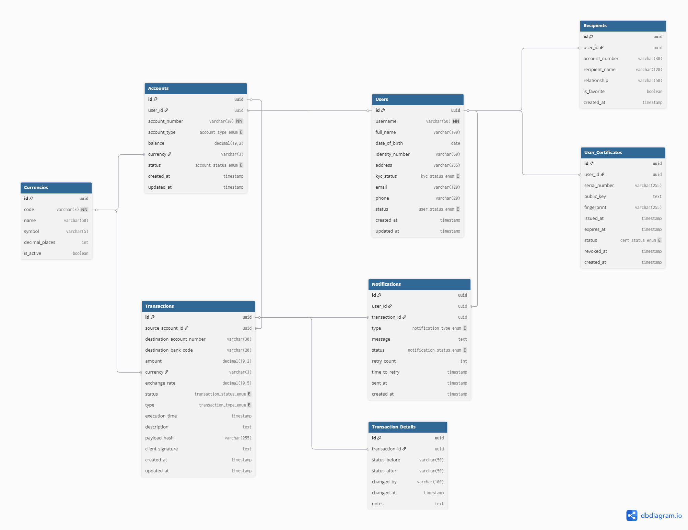

# DATABASE DESIGN

## Documentation
### Users table

#### Chức năng
- Lưu thông tin của khách hàng

#### Cấu trúc
- id: UUID/BIGINT (PK) - Khóa chính, định danh duy nhất
- username: VARCHAR(50) - Tên đăng nhập, phải duy nhất
- full_name: VARCHAR(100) - Họ và tên đầy đủ trên giấy tờ tùy thân.
- date_of_birth: DATE - Ngày tháng năm sinh (đảm bảo đủ tuổi mở tài khoản theo luật định).
- identity_number: VARCHAR(50) (UNIQUE) - Số CMND/CCCD/Hộ chiếu.
- address: VARCHAR(255) - Địa chỉ thường trú.
- kyc_status: ENUM('unverified', 'pending', 'verified', 'rejected') - Trạng thái xác thực danh tính.
- email: VARCHAR(120) - Email, dùng để khôi phục mật khẩu & thông báo
- phone: VARCHAR(20) - Số điện thoại, dùng gửi OTP
- status: ENUM('active', 'locked', 'deleted') - Trạng thái tài khoản
- created_at: TIMESTAMP - Ngày tạo tài khoản
- updated_at: TIMESTAMP - Cập nhật lần cuối

### Accounts table

#### Chức năng
- Lưu thông tin tài khoản của một khách hàng
- Mỗi khác hàng có thể có nhiều tài khoản

#### Cấu trúc
- id: UUID (PK) - Khóa chính
- user_id: UUID (FK) - Tham chiếu đến Users
- account_number: VARCHAR(30) - Số tài khoản (định dạng: IBAN hoặc định dạng quốc gia)
- account_type: ENUM(checking, savings, credit) - Loại tài khoản
- balance: DECIMAL(19, 2) - Số dư hiện tại
- currency: VARCHAR(3) - Mã tiền tệ (VND, USD, EUR...)
- status: ENUM(active, inactive, blocked) - Trạng thái hoạt động
- created_at: TIMESTAMP - Ngày mở tài khoản
- updated_at: TIMESTAMP - Cập nhật lần cuối

### Transactions table

#### Chức năng
- Lưu thông tin tại một thời điểm của một giao dịch

#### Cấu trúc
- id: UUID (PK) 
- source_account_id: UUID (FK) - Tài khoản gửi (tham chiếu Accounts)
- destination_account_number: VARCHAR(30) - Số tài khoản nhận (hỗ trợ inter-bank)
- destination_bank_code: VARCHAR(20) - Mã ngân hàng nhận (NULL nếu nội bộ)
- amount: DECIMAL(19, 2)
- currency: VARCHAR(3)
- exchange_rate: DECIMAL(10, 5) - Tỷ giá quy đổi tại thời điểm thực hiện
- status: ENUM(pending, processing, completed, failed, reversed)
- type: ENUM(same_bank, inter_bank, international)
- execution_time: TIMESTAMP
- description: TEXT
- payload_hash: VARCHAR(255) - Mã băm của toàn bộ nội dung giao dịch nguyên thủy (Plaintext Payload)
- client_signature: TEXT - Chữ ký số điện tử của Client (Sign(Payload, privKey_c)) - Bằng chứng chống chối bỏ
- created_at: TIMESTAMP
- updated_at: TIMESTAMP

### Recipients table
#### Chức năng
- Lưu thông tin người nhận tiền

#### Cấu trúc
- id: UUID (PK) - Khóa chính
- user_id: UUID (FK) - Người dùng sở hữu danh bạ
- account_number: VARCHAR(30) - Số tài khoản người nhận 
- recipient_name: VARCHAR(120) - Tên người nhận (dùng để xác nhận)
- relationship: VARCHAR(50) - Mối quan hệ (anh em, bạn bè, công ty...)
- is_favorite: BOOLEAN - Đánh dấu người nhận thường xuyên
- created_at: TIMESTAMP - Ngày lưu vào danh bạ

### Transaction Details table

#### Chức năng
- Lưu thông tin chi tiết từng trạng thái thay đổi của một giao dịch
- Ví dụ giao dịch A sẽ trải qua các quá trình: 
    - pending -> processing
    - processing -> completed
    - completed -> reversed
- Nhiệm vụ của bảng này là lưu lại lịch sử của một giao dịch
- Mỗi lần một giao dịch thay đổi sẽ thêm 1 bản ghi mới vào bảng này

#### Cấu trúc
- id: UUID (PK) - Khóa chính
- transaction_id: UUID (FK) - Giao dịch liên quan
- status_before: VARCHAR(50) - Trạng thái trước
- status_after: VARCHAR(50) - Trạng thái sau
- changed_by: VARCHAR(100) - Người/hệ thống thay đổi
- changed_at: TIMESTAMP - Thời gian thay đổi
- notes: TEXT - Ghi chú (lý do nếu thất bại)

### User Certificates table
#### Chức năng
- Lưu trữ thông tin chứng chỉ công khai X.509 của người dùng do CA Service cấp.
- Phục vụ việc Bank Server kiểm tra tính hợp lệ của khóa công khai (pubKey_c) khi xác minh chữ ký.

#### Cấu trúc
- id: UUID (PK)
- user_id: UUID (FK) - Chủ sở hữu
- serial_number: VARCHAR(255) (UNIQUE) - Số serial của X.509
- public_key: TEXT - Khóa công khai (pubKey_c) lưu dạng PEM
- fingerprint: VARCHAR(255) - Mã băm (hash) của chứng chỉ
- issued_at: TIMESTAMP - Ngày cấp
- expires_at: TIMESTAMP - Ngày hết hạn
- status: ENUM('active', 'revoked', 'expired') - Trạng thái (phục vụ CRL)
- revoked_at: TIMESTAMP (NULLABLE) - Thời điểm bị thu hồi (nếu có)
- created_at: TIMESTAMP

### Notifications table

#### Chức năng
- Mỗi lần gửi thông báo sms hay email cho khách hàng thì sẽ tạo 1 bản ghi mới vào bảng này

#### Cấu trúc
- id: UUID (PK) - Khóa chính
- user_id: UUID (FK) - Người nhận thông báo
- transaction_id: UUID (FK) - Giao dịch liên quan (NULLABLE)
- type: ENUM(sms, email) - Loại thông báo
- message: TEXT - Nội dung thông báo
- status: ENUM(pending, sent, failed) - Trạng thái gửi
- retry_count: INT - Số lần thử gửi lại
- time_to_retry: TIMESTAMP - Thời gian chờ trước khi thử lại
- sent_at: TIMESTAMP - Thời gian gửi
- created_at: TIMESTAMP - Lúc tạo   

### Currencies table
#### Chức năng
- Lưu thông tin tiền tệ
- Có thể gọi API để lấy tỷ giá tiền tệ

#### Cấu trúc
- id: UUID (PK) - Khóa chính
- code: VARCHAR(3) - Mã ISO (VND, USD, EUR...)
- name: VARCHAR(50) - Tên tiền tệ
- symbol: VARCHAR(5) - Ký hiệu (₫, $, €...)
- decimal_places: INT - Số chữ số thập phân
- is_active: BOOLEAN - Có đang sử dụng?

---
## ERD

