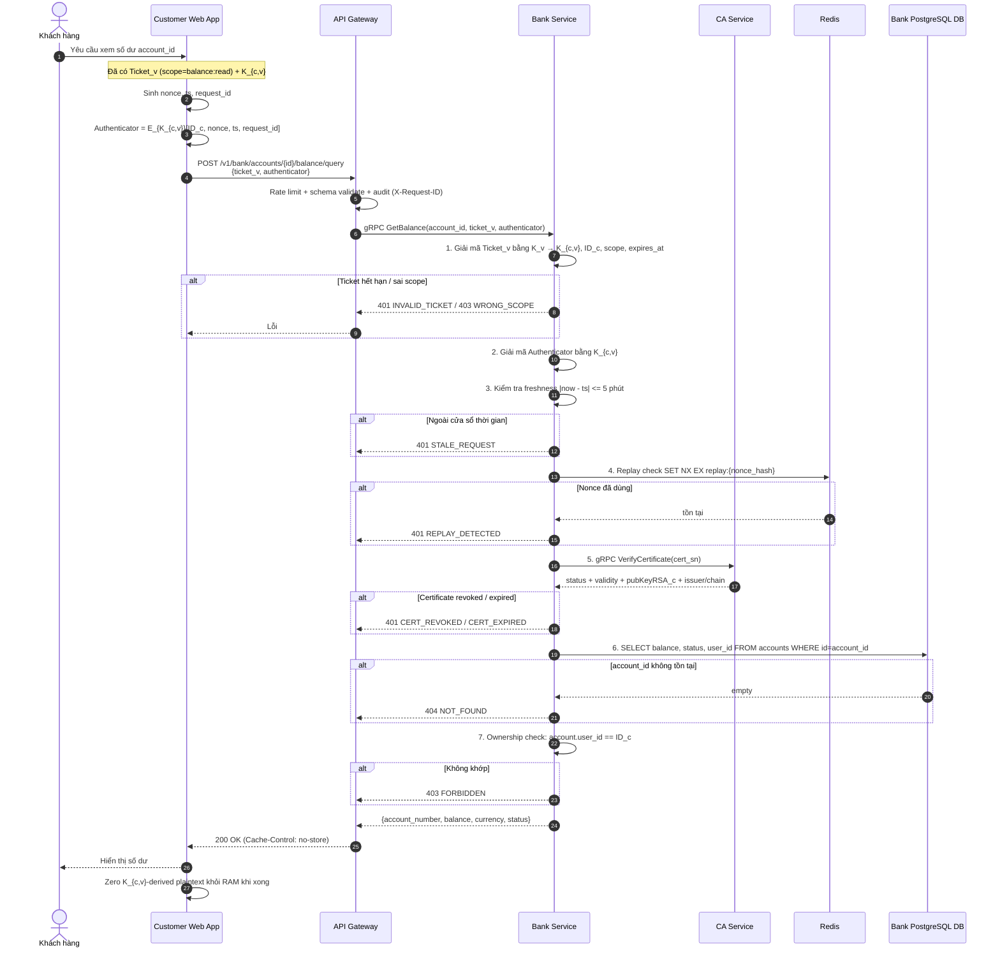
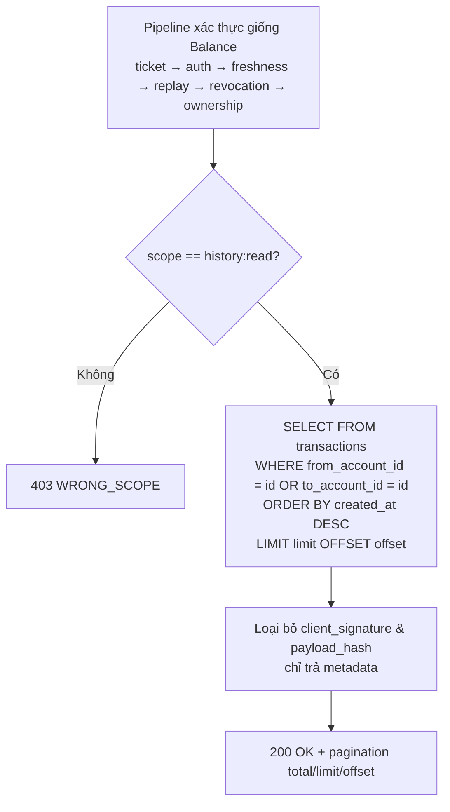
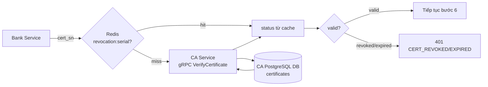

# Báo cáo: Quy trình Xem Số Dư & Lịch Sử Giao Dịch

> Nguồn tham chiếu:
> - `blueprint/design.md`
> - `blueprint/specs/05-bank-balance-history.md`
> - `blueprint/api-design/05-bank-balance-history.md`
> - `blueprint/api-design/base-api.md`

Báo cáo này gồm 3 phần:
1. Sơ đồ flow (Mermaid) cho quy trình xem số dư / lịch sử.
2. Giải thích chi tiết cơ chế **khóa (keys)** và **certificate** trong luồng.
3. Mô tả **dữ liệu** chứa trong từng khóa / ticket / certificate.

---

## 1. Tổng quan

Hai endpoint đọc dữ liệu tài khoản:

| Method | Endpoint | Scope yêu cầu |
|---|---|---|
| `POST` | `/v1/bank/accounts/{account_id}/balance/query` | `balance:read` |
| `POST` | `/v1/bank/accounts/{account_id}/transactions/query` | `history:read` |

Cả hai đều là **read-action dùng POST** để gửi `Ticket_v` + `Authenticator` trong body (tương thích browser/proxy, không lộ secret trên URL). Mọi response đều `Cache-Control: no-store`.

Điều kiện tiên quyết: khách hàng đã hoàn tất **Phase 1 (PKI Enrollment)**, **Phase 2 (AS Exchange)** và **Phase 3 (TGS Exchange)**, nên client đang giữ sẵn:
- `Ticket_v` (mã hóa bằng `K_v`, chỉ Bank Service mở được).
- `K_{c,v}` (session key giữa client và Bank Service, nằm trong RAM).
- Wrapped private key `privKeyRSA_c` trong IndexedDB.

---

## 2. Sơ đồ Flow — Xem Số Dư (Balance Query)



### Flow Xem Lịch Sử (Transaction History)

Giống hệt các bước 1–7 ở trên với `scope = 'history:read'`, chỉ khác bước truy vấn DB và response:



> Phân trang: `limit` mặc định 20, tối đa 100; `offset` mặc định 0. Response **không** chứa `client_signature` và `payload_hash` (chỉ dùng cho audit nội bộ).

---

## 3. Pipeline xác thực của Bank Service (7 cổng "fail-closed")

Bank Service áp dụng nguyên tắc **fail closed**: nếu bất kỳ bước nào không verify được thì reject ngay, không trả dữ liệu.

```mermaid
flowchart LR
    T[Ticket_v] -->|giải mã K_v| S1[1. Ticket hợp lệ?<br/>scope + TTL]
    S1 --> S2[2. Authenticator hợp lệ?<br/>giải mã K_{c,v}]
    S2 --> S3[3. Freshness?<br/>±5 phút]
    S3 --> S4[4. Replay?<br/>Redis SET NX EX]
    S4 --> S5[5. Revocation?<br/>CA VerifyCertificate]
    S5 --> S6[6. Account tồn tại?]
    S6 --> S7[7. Ownership?<br/>user_id == ID_c]
    S7 --> OK[Trả dữ liệu]

    S1 -.fail.-> X[Reject + audit]
    S2 -.fail.-> X
    S3 -.fail.-> X
    S4 -.fail.-> X
    S5 -.fail.-> X
    S6 -.fail.-> X
    S7 -.fail.-> X
```

---

## 4. Giải thích chi tiết về KHÓA (Keys)

Luồng xem số dư/lịch sử **không tạo khóa mới** — nó **tiêu thụ** các khóa đã được cấp ở các phase trước. Có 4 loại khóa liên quan trực tiếp:

### 4.1. `K_v` — Service Master Key của Bank Service

| Thuộc tính | Giá trị |
|---|---|
| Owner | Bank Service |
| Sinh ở đâu | Provisioning local/demo (env/file secret) |
| Lưu ở đâu | Env/file secret trong Bank Service — **không bao giờ rời server** |
| Mục đích | Mã hóa & **giải mã `Ticket_v`** |
| Thuật toán | AES-256-GCM |
| Lifetime | Dài hạn (demo); production cần rotation + key version |

**Vai trò trong flow:** Đây là khóa cho phép Bank Service mở `Ticket_v` ở **bước 1**. Vì chỉ Bank Service có `K_v`, không ai khác (kể cả client hay Gateway) đọc được nội dung ticket → đảm bảo `K_{c,v}` và scope bên trong ticket là đáng tin.

### 4.2. `K_{c,v}` — Session Key giữa Client và Bank Service

| Thuộc tính | Giá trị |
|---|---|
| Owner | Customer Web App + Bank Service |
| Sinh ở đâu | KDC sinh trong **TGS Exchange** (Phase 3) |
| Lưu ở đâu | Client: RAM (session memory). Server: được **gói kín bên trong `Ticket_v`** (mã hóa bằng `K_v`) |
| Mục đích | Mã hóa/giải mã **Authenticator**; mã hóa response (nếu có) |
| Thuật toán | AES-256-GCM, IV 96-bit random mỗi lần mã hóa |
| Lifetime | Theo `Ticket_v`, đề xuất 5–10 phút |

**Vai trò trong flow:**
- Client dùng `K_{c,v}` để tạo Authenticator (bước "chuẩn bị request").
- Bank Service lấy `K_{c,v}` **từ trong ticket** (sau khi giải mã bằng `K_v`), rồi dùng nó giải mã Authenticator ở **bước 2**.
- Đây chính là cơ chế **mutual authentication**: nếu client không có đúng `K_{c,v}`, Authenticator sẽ giải mã sai → reject. Ngược lại, chỉ Bank Service (có `K_v`) mới lấy được `K_{c,v}` → client tin server thật.

> Lưu ý ADR-08: hệ thống **không** dùng subsession key `K_sub`; dùng trực tiếp `K_{c,v}` + random IV mỗi lần là đủ freshness trong TTL ngắn 5–10 phút.

### 4.3. `privKeyRSA_c` / `pubKeyRSA_c` — Cặp khóa danh tính của khách hàng

| Thuộc tính | `privKeyRSA_c` | `pubKeyRSA_c` |
|---|---|---|
| Owner | Khách hàng | Khách hàng |
| Sinh ở đâu | Customer Web App (WebCrypto API) | Customer Web App |
| Lưu ở đâu | IndexedDB (wrapped), unwrap trong RAM khi dùng | Trong X.509 + CA DB |
| Mục đích | Ký CSR, AS_REQ, payload giao dịch | Verify chữ ký |

**Vai trò trong flow xem số dư/lịch sử:** Trong **đường đọc (read path)**, payload số dư/lịch sử **không bắt buộc ký số** như transfer. Tuy nhiên `pubKeyRSA_c` vẫn liên quan gián tiếp: ở **bước 5**, Bank Service gọi CA `VerifyCertificate(cert_sn)` và nhận về `pubKeyRSA_c` + trạng thái certificate + issuer/chain metadata. Điều này gắn `Ticket_v`/`ID_c` với một danh tính có user certificate do Client CA cấp và còn hợp lệ (chưa revoke/expired).

> So với Flow 3 (transfer): transfer dùng `privKeyRSA_c` ký canonical payload và Bank verify chữ ký bằng `pubKeyRSA_c`. Read path nhẹ hơn — chủ yếu dựa vào `Ticket_v` + Authenticator + revocation check.

### 4.4. `K_{c,tgs}` (gián tiếp)

Không xuất hiện trực tiếp trong read path, nhưng là khóa đã được dùng ở Phase 3 để client lấy được `Ticket_v` + `K_{c,v}`. Đề cập để hoàn chỉnh chuỗi tin cậy:
`K_{c,tgs}` (Phase 2) → xin `Ticket_v` + `K_{c,v}` (Phase 3) → dùng `K_{c,v}` để xem số dư (read path).

---

## 5. Giải thích chi tiết về CERTIFICATE (X.509)

### 5.1. Vai trò trong flow

Ở **bước 5** của pipeline, Bank Service **bắt buộc** kiểm tra certificate qua CA Service (hoặc revocation cache TTL ngắn trong Redis) trước khi trả dữ liệu. Đây là nguyên tắc **strict revocation check** + **fail closed**: certificate đã thu hồi thì dù `Ticket_v` còn hạn vẫn bị từ chối (`401 CERT_REVOKED`).



### 5.2. Tại sao certificate là trung tâm của niềm tin

- **Root CA là trust anchor cao nhất**: hệ thống chỉ tin `pubKeyRSA_c` nếu nó nằm trong X.509 hợp lệ do Client CA ký và chain về Root CA. Bank/KDC **không bao giờ** nhận public key raw từ request → chống **public-key substitution**.
- `root-ca.crt` và `client-ca.crt` được phân phối trong trust bundle/service config để verify chain và chống MITM thay khóa.
- CA DB là nguồn dữ liệu duy nhất cho trạng thái revocation, đảm bảo Admin revoke xong là Bank Service thấy ngay (sau khi cache TTL hết hoặc bị invalidate).

---

## 6. DỮ LIỆU bên trong từng cấu trúc

### 6.1. Dữ liệu trong `Ticket_v` (mã hóa bằng `K_v`)

| Trường | Ý nghĩa |
|---|---|
| `K_{c,v}` | Session key chia sẻ với client |
| `ID_c` | Định danh khách hàng (dùng cho ownership check bước 7) |
| `cert_sn` | Serial number của certificate (dùng cho revocation check bước 5) |
| `service_id` | Định danh service đích (Bank Service) |
| `scope` | `balance:read` hoặc `history:read` — kiểm tra ở bước 1 |
| `issued_at` | Thời điểm cấp ticket |
| `expires_at` | Hết hạn (5–10 phút) |
| `key_version` | Phiên bản `K_v` dùng để mã hóa |
| `nonce/session_id` | Định danh phiên |

### 6.2. Dữ liệu trong `Authenticator` (mã hóa bằng `K_{c,v}`)

`Authenticator = E_{K_{c,v}}[ID_c, nonce, timestamp, request_id]`

| Trường | Mục đích |
|---|---|
| `ID_c` | Xác nhận danh tính client trùng với trong ticket |
| `nonce` | Chống replay (bước 4, Redis `SET NX EX`) |
| `timestamp` | Kiểm tra freshness ±5 phút (bước 3) |
| `request_id` | Trace + idempotency cho replay cache key |

### 6.3. Dữ liệu trong `X.509_c` certificate (lưu CA DB)

| Trường | Ý nghĩa |
|---|---|
| `serial` | Số serial duy nhất (= `cert_sn`) |
| `subject` | Danh tính khách hàng |
| `pubKeyRSA_c` | Public key để verify chữ ký |
| `public key fingerprint` | Dùng cho search/đối chiếu |
| `issuer` / `chain` | Cho biết cert do Client CA ký và chain về Root CA |
| `not_before` / `not_after` | Cửa sổ hiệu lực |
| `status` | `valid` / `revoked` / `expired` |
| `revocation reason` | Lý do thu hồi (nếu có) |
| `issued_at` / audit metadata | Phục vụ Admin Dashboard & truy vết |

### 6.4. Dữ liệu trả về cho client

**Balance response:** `account_id`, `account_number`, `balance` (int64 cents), `currency`, `status`.

**History response (mỗi item):** `tx_id`, `from_account_number`, `to_account_number`, `amount`, `currency`, `status`, `description`, `scope`, `created_at`, `completed_at` + khối `pagination` (`total`, `limit`, `offset`).

> **Không bao giờ** trả: `client_signature`, `payload_hash`, key material, nội dung ticket, hay lý do lỗi nội bộ chi tiết.

---

## 7. Bảng tổng kết Khóa & Cert trong read path

| Thành phần | Ai giữ | Mã hóa/Verify bằng | Bước dùng | Hậu quả nếu sai |
|---|---|---|---|---|
| `Ticket_v` | Client gửi, Bank mở | `K_v` | 1 | `401 INVALID_TICKET` |
| `scope` trong ticket | Bank | (đọc plaintext sau giải mã) | 1 | `403 WRONG_SCOPE` |
| `Authenticator` | Client tạo, Bank mở | `K_{c,v}` | 2 | `401 UNAUTHORIZED` |
| `timestamp` | — | — | 3 | `401 STALE_REQUEST` |
| `nonce` | — | Redis | 4 | `401 REPLAY_DETECTED` |
| `X.509_c` | CA DB | Root CA → Client CA chain | 5 | `401 CERT_REVOKED/EXPIRED` |
| `ID_c` (ownership) | Bank vs DB | — | 7 | `403 FORBIDDEN` |

---

## 8. Kết luận

Quy trình xem số dư/lịch sử là một **read path bảo mật nhiều lớp** tái sử dụng hạ tầng Kerberos-like + PKI:

1. **`K_v`** mở `Ticket_v` → lấy `K_{c,v}`, `scope`, `ID_c`, `cert_sn`.
2. **`K_{c,v}`** xác thực client qua Authenticator (mutual auth + chống replay).
3. **Certificate (X.509) + Root CA/Client CA chain** đảm bảo danh tính còn hợp lệ (strict revocation).
4. **Ownership check** đảm bảo khách hàng chỉ xem được dữ liệu của chính mình.

Toàn bộ tuân thủ **fail-closed**, **no-store**, **Zero-Knowledge** (private key không rời browser) và **least-data-exposure** (không trả secret/chữ ký nội bộ).
