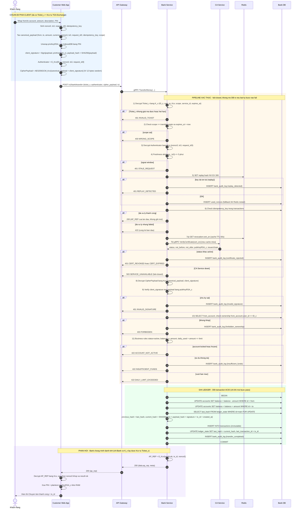

# Flow: Bank Transfer (AP Exchange — Phase 4)

Sơ đồ luồng cho:
- `blueprint/specs/04-bank-transfer.md`
- `blueprint/api-design/04-bank-transfer.md`
- `blueprint/design.md` — Flow 3: Secure Banking Transaction + Bank transaction authorization pipeline

Endpoint duy nhất: `POST /v1/bank/transfer` — auth bằng `Ticket_v` (scope `transfer:create`) + Authenticator.

---

## 1. Sequence Diagram (đầy đủ pipeline + nhánh lỗi)

---

## 2. Chú thích Key / Ticket / Payload — chứa gì

### 2.1. Khóa dài hạn của service (không rời server)

| Khóa | Owner | Nội dung / Mục đích |
|---|---|---|
| `K_v` | Bank Service | Khóa đối xứng dài hạn (AES-256) **chỉ Bank Service giữ**. Dùng để **giải mã `Ticket_v`**. Đây là lý do chỉ Bank mới lấy được `K_{c,v}` bên trong ticket → nền tảng để Bank "chứng minh danh tính" qua AP_REP. Lưu env/file secret (production: KMS/HSM, có key version) |
| `privKeyRSA_c` | Khách hàng | Private key client, **wrapped trong IndexedDB**, unwrap bằng PIN trong RAM. Dùng ký `canonical_payload`. Không bao giờ rời browser; xóa khỏi RAM sau khi dùng |
| `pubKeyRSA_c` | Khách hàng | Public key client — Bank **không** nhận từ request mà lấy từ user certificate do Client CA ký qua `VerifyCertificate(cert_sn)` của CA Service. Dùng verify `client_signature` |

### 2.2. `Ticket_v` (do KDC cấp ở TGS Exchange, Bank giải mã)

`Ticket_v = E_{K_v}[ ... ]` — mã hóa bằng `K_v`, client **không đọc được**, chỉ chuyển tiếp. Bên trong chứa:

| Trường | Ý nghĩa |
|---|---|
| `ID_c` | User ID khách hàng (= `users.id`); dùng check ownership |
| `cert_sn` | Serial user/client certificate do Client CA cấp, dùng để chain/status/revocation check qua CA |
| `K_{c,v}` | **Session key** giữa client ↔ Bank (AES-256), KDC sinh; là bí mật chia sẻ cốt lõi |
| `scope` | Phải = `transfer:create`; Bank verify độc lập, không tin scope từ request |
| `service_id` | `"bank"` |
| `issued_at` / `expires_at` | TTL 5–10 phút; reusable trong TTL |

### 2.3. `Authenticator` (client tạo mỗi request)

`Authenticator = E_{K_{c,v}}[ID_c, nonce3, ts3, request_id3]` — mã hóa AES-256-GCM bằng `K_{c,v}`.

| Trường | Vai trò |
|---|---|
| `ID_c` | Phải khớp `ID_c` trong ticket — chứng minh client thực sự nắm `K_{c,v}` |
| `nonce3` | 32 random bytes — chống replay (`SET NX EX` trên Redis) |
| `ts3` | Timestamp — freshness window ±5 phút |
| `request_id3` | UUID — trace + thành phần của replay cache key |

> `Ticket_v` reusable trong TTL nhưng **mỗi request phải có Authenticator mới** (nonce/ts/request_id riêng) → chống replay dù dùng lại ticket.

### 2.4. `canonical_payload` + `client_signature` (trong `CipherPayload`)

`CipherPayload = AES-256-GCM_{K_{c,v}}[canonical_payload ‖ client_signature]` (kèm IV 12 bytes random).

**canonical_payload** (nội dung giao dịch, được ký):

| Trường | Ý nghĩa |
|---|---|
| `from_account_number`, `to_account_number` | Số tài khoản gửi/nhận (chuỗi số, `accounts.account_number`). Bank resolve sang `accounts.id` (UUID) qua `LoadAccountForUpdateByNumber` rồi check ownership `from.user_id == ID_c` |
| `amount` | Số tiền (int64, cents) |
| `currency` | VND |
| `nonce`, `timestamp`, `request_id` | Freshness/replay ở mức payload |
| `idempotency_key` | UUID — chống double-spend khi retry (UNIQUE trong `transactions`) |
| `scope` | `transfer:create` |

**client_signature** = `Sign(SHA-256(canonical_payload_json), privKeyRSA_c)` (RSA-PSS/ECDSA) — bằng chứng **chống chối bỏ (non-repudiation)**, lưu vĩnh viễn trong `transactions`.

### 2.5. `AP_REP` (Bank trả về — mutual auth)

`AP_REP = E_{K_{c,v}}[result, tx_id, nonce3]` — mã hóa bằng `K_{c,v}`.

| Trường | Vai trò |
|---|---|
| `result` | `"ok"` |
| `tx_id` | UUID giao dịch vừa ghi |
| `nonce3` | Echo lại nonce client gửi — client xác nhận khớp để chống MITM/replay response |

Chỉ Bank Service (có `K_v`) mới lấy được `K_{c,v}` để tạo AP_REP hợp lệ → client tin chắc đang nói chuyện với Bank thật.

---

## 3. Bảng dữ liệu & cache liên quan

| Bảng / Key | Store | Thao tác |
|---|---|---|
| `accounts` | Bank DB | SELECT (balance/limit/status); UPDATE balance trong ACID tx |
| `transactions` | Bank DB | INSERT (immutable ledger; UNIQUE `nonce`, `idempotency_key`) |
| `used_nonces` | Bank DB | INSERT (fallback replay khi Redis restart) |
| `bank_audit_log` | Bank DB | INSERT transfer_completed/rejected + lỗi security |
| `ledger_state` | Bank DB | SELECT ... FOR UPDATE (serialize hash-chain) |
| `replay:{nonce_hash}` | Redis | SET NX EX (primary replay check) |
| `revocation:{serial}` | Redis | GET (cache TTL 60s) |
| `certificates` | CA DB (qua gRPC) | `VerifyCertificate`: status + validity + public key + issuer/chain metadata |

---

## 4. Bất biến bảo mật cốt lõi

- **Fail-closed**: bất kỳ check nào fail trước ghi ledger → reject, không mở DB transaction (CA down → 503).
- **Immutable ledger**: `transactions` chỉ INSERT; hash chaining (`current_hash` phụ thuộc `previous_hash`) phát hiện sửa lịch sử.
- **Ledger concurrency**: `SELECT ... FOR UPDATE` trên `ledger_state` chống hai transfer cùng `previous_hash` (rẽ nhánh chain).
- **Replay 2 lớp**: Redis (primary) + `used_nonces` (persistent fallback); UNIQUE `nonce` ở DB là chốt chặn cuối.
- **Idempotency**: UNIQUE `idempotency_key` → retry trả kết quả cũ, không double-spend.
- **Ownership bắt buộc**: `from_account.user_id == ID_c` — ticket hợp lệ vẫn không chuyển hộ tài khoản người khác.
- **Trust model**: public key luôn lấy từ user certificate do Client CA ký và chain về Root CA (không tin raw key từ request) → chống public-key substitution.
- **Non-repudiation**: `client_signature` lưu vĩnh viễn — bằng chứng client đã uỷ quyền giao dịch.
- **Không information leakage**: response lỗi không trả key material, nội dung ticket, hay lý do nội bộ chi tiết.
- **Zero-knowledge / cleanup**: PIN + plaintext private key bị xóa khỏi RAM sau khi hoàn tất.
