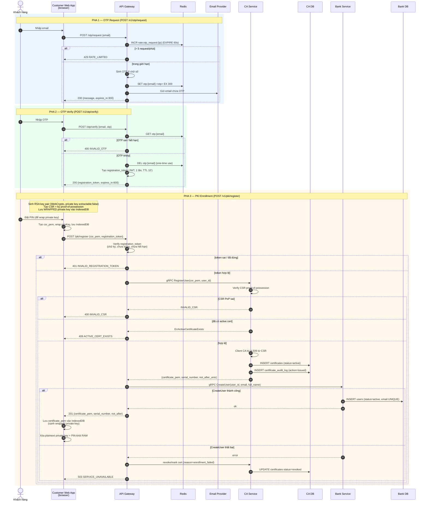

# Flow: OTP & PKI Registration

Sơ đồ luồng cho `blueprint/api-design/01-otp-pki-registration.md` — đăng ký khách hàng mới gồm 3 endpoint: OTP request → OTP verify → PKI register.

---

## 1. Sequence Diagram

---

## 2. Chú thích Key & Cert — nội dung chứa gì

### 2.1. Khóa sinh ở browser (không bao giờ rời browser dạng plaintext)

| Thành phần | Loại | Nội dung / Cấu trúc | Lưu ở đâu |
|---|---|---|---|
| `privKeyRSA_c` | RSA private key (client) | Khóa bí mật của khách hàng. Sinh bằng WebCrypto với `extractable: false`. **Không bao giờ gửi lên server.** Dùng để: (1) ký CSR (proof-of-possession), (2) sau này ký AS_REQ và ký giao dịch | **Wrapped** trong IndexedDB (bọc bằng khóa dẫn xuất từ PIN) |
| `pubKeyRSA_c` | RSA public key (client) | Khóa công khai tương ứng. Được nhúng trong CSR và sau đó trong X.509 certificate do Client CA ký. CA/KDC/Bank dùng để verify chữ ký của client | Công khai — trong CSR & certificate |
| PIN | Secret người dùng | Dùng để **wrap/unwrap** `privKeyRSA_c`. Không lưu — chỉ tồn tại tạm trong RAM, xóa sau khi dùng | RAM (tạm thời) |

### 2.2. CSR — Certificate Signing Request (`csr_pem`)

Định dạng PEM (`-----BEGIN CERTIFICATE REQUEST-----`). Chứa:

| Trường | Ý nghĩa |
|---|---|
| `Subject` | Thông tin định danh: CN (full name/email), email |
| `Public Key` | `pubKeyRSA_c` — khóa công khai của khách hàng |
| `Signature` | **Proof-of-Possession**: chữ ký trên chính CSR bằng `privKeyRSA_c`, chứng minh client sở hữu private key tương ứng với public key trong CSR |

CA verify chữ ký này khớp public key trong CSR trước khi cấp cert.

### 2.3. X.509 Certificate (`certificate_pem`) — Client CA cấp

Định dạng PEM (`-----BEGIN CERTIFICATE-----`), được Client CA ký bằng `client-ca.key`. Client CA là Intermediate CA do Root CA ký. Chứa:

| Trường | Ý nghĩa |
|---|---|
| `serial_number` | Hex-encoded serial X.509 — **key chính** để KDC/Bank lookup & revocation check |
| `Subject` (CN, email) | Định danh khách hàng (`subject_cn`, `subject_email`) |
| `Public Key` | `pubKeyRSA_c` — public key của khách hàng |
| `Issuer` | Client CA của hệ thống |
| `not_before` / `not_after` | Cửa sổ hiệu lực certificate |
| `Signature` | Chữ ký của Client CA đảm bảo tính toàn vẹn và chain về Root CA |
| `fingerprint_sha256` | SHA-256 fingerprint (lưu ở CA DB) cho tra cứu nhanh |

> `owner_id` trong CA DB = `users.id` trong Bank DB = `ID_c` dùng trong ticket sau này. Liên kết lỏng (VARCHAR), không FK cứng.

### 2.4. Root CA và Client CA

| Thành phần | Nội dung |
|---|---|
| `root-ca.key` | Khóa bí mật của Root CA, là trust anchor cao nhất. Chỉ dùng để ký Intermediate CA, không ký trực tiếp user cert trong runtime bình thường |
| `client-ca.key` | Khóa bí mật của Client CA, nằm trong CA Service hoặc secret store. Dùng để ký user/client certificate từ CSR |
| `client-ca.crt` | Intermediate CA certificate do Root CA ký. KDC/Bank tin user cert vì chain là Root CA → Client CA → `X.509_c` |

### 2.5. `registration_token`

| Thành phần | Nội dung |
|---|---|
| `registration_token` | JWT ngắn hạn (TTL 10 phút), **dùng 1 lần**. Phát hành sau khi verify OTP thành công; bị vô hiệu hóa ngay sau khi `/pki/register` thành công. Liên kết phiên OTP với phiên enrollment (chứa email/user_id đã xác minh) |

---

## 3. Ràng buộc bảo mật chính

- **Private key không rời browser** ở bất kỳ bước nào — server chỉ nhận CSR (chứa public key + chữ ký PoP).
- **`registration_token` dùng 1 lần** — vô hiệu ngay sau khi register thành công.
- **OTP TTL 5 phút**, xóa khỏi Redis ngay sau verify thành công.
- **Một user tối đa 1 cert `active`** tại một thời điểm (partial unique index `owner_id WHERE status=active` trong CA DB).
- **User record Bank DB chỉ tạo sau khi CA xác nhận cấp cert thành công**; nếu `CreateUser` fail → revoke cert vừa cấp (`enrollment_failed`) để tránh cert active mồ côi.
- **Không information leakage**: lỗi OTP không phân biệt "sai" vs "hết hạn" — chỉ trả `INVALID_OTP`.
