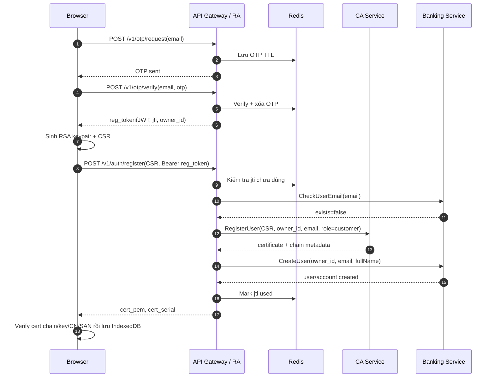
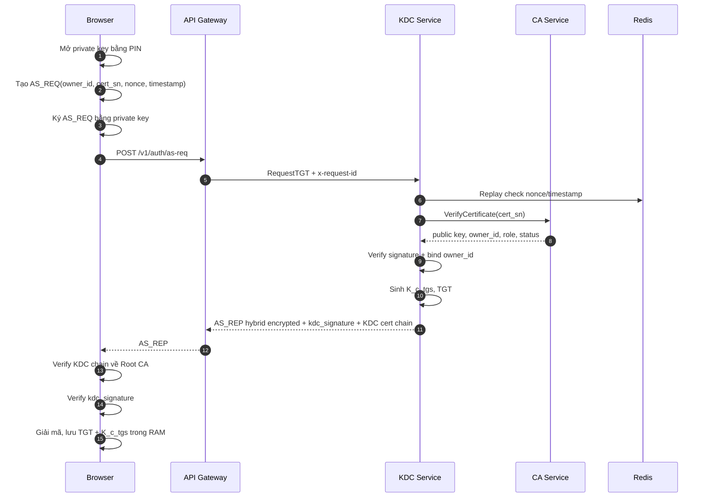
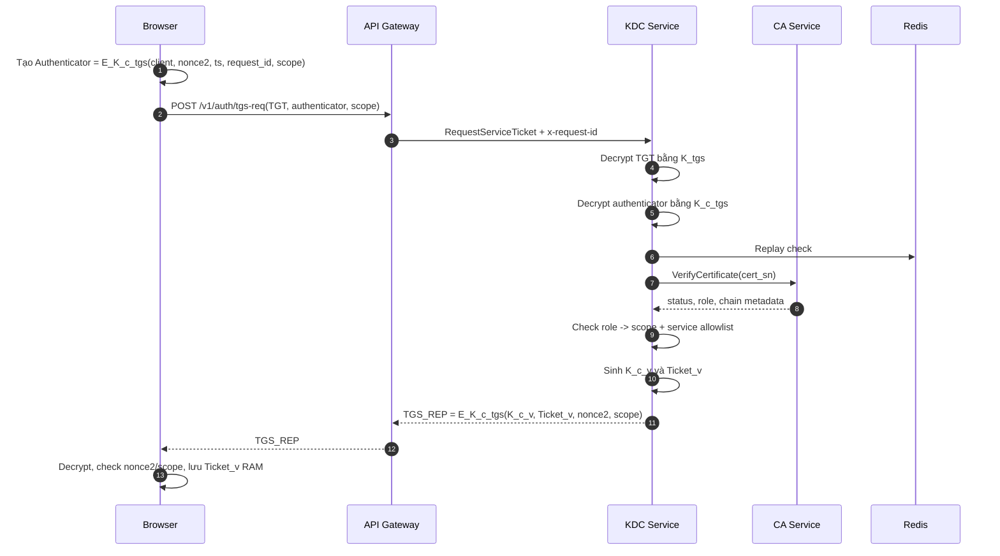
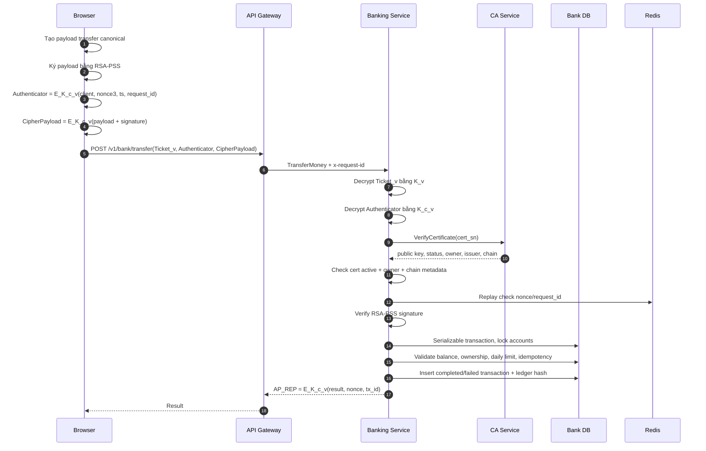
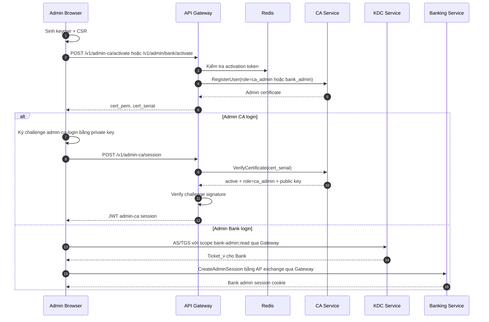
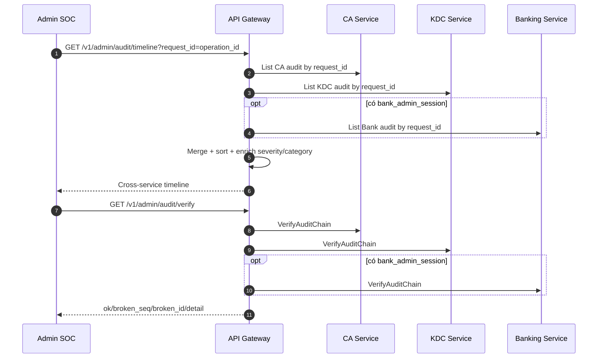

# Báo Cáo Final - Mini Banking App

> Ngày cập nhật: 11/07/2026  
> Ngôn ngữ: Tiếng Việt  
> Ghi chú: bản rút gọn để viết báo cáo nộp, có sequence diagram cho các luồng chính.

## 0. Thông Tin Nhóm Và Tài Liệu Nộp

| Mục | Nội dung |
|---|---|
| Tên đề tài | Mini Banking App - Secure Banking Workflow with PKI, Kerberos-like Tickets and Audit SOC |
| Môn học | Applied Cryptography |
| Nhóm | G05 |
| Lớp | 23_22 |
| Giảng viên hướng dẫn | Trương Toàn Thịnh, Mai Anh Tuấn |
| Repository | https://github.com/TNTT2305hcmus/mini-banking-app |
| Video demo YouTube | TBD - điền link YouTube demo sau khi upload |
| Hướng dẫn chạy | `README.md`, `RUN.md`, `demo_test_guide/guide/RUN_GUIDE.md` |
| Testcase | `demo_test_guide/tests/` |
| Kết quả runtime | `demo_test_guide/tests/runtime-results.md` |

### Tỷ Lệ Đóng Góp

| Thành viên | Phần việc chính | Tỷ lệ đề xuất |
|---|---|---:|
| Thanh | Lead, PKI registration, CA layerd architecture, Admin CA, register consistency, CA auth flow | 25% |
| Thái | Admin Bank, dashboard, user/account/transaction view, Bank UI/API flow | 25% |
| Thuận | Audit, SOC, trace/operation id, hash-chain testcase, security monitoring | 25% |
| Quang | KDC/Bank integration, compose/env, seed, smoke script, demo/runtime guide | 25% |
| Tổng |  | 100% |

## 1. Mô Tả Đề Tài

Mini Banking App là hệ thống demo ngân hàng thu nhỏ tập trung vào các cơ chế Applied Cryptography:

- Đăng ký người dùng bằng OTP, CSR và chứng thư X.509.
- Lưu private key ở browser, wrap bằng PIN, không gửi plaintext lên server.
- Đăng nhập/gọi dịch vụ theo mô hình Kerberos-like: AS -> TGS -> AP.
- Ký số banking payload bằng RSA-PSS, mã hóa payload bằng AES-GCM.
- Phân quyền bằng certificate role và service ticket scope.
- Quản trị CA, quản trị Bank và SOC audit.
- Audit hash-chain để phát hiện sửa/xóa/đảo event.

Hệ thống là coursework/demo, không xử lý tiền thật và không claim production banking compliance.

## 2. Kiến Trúc Và Mô Hình Tin Cậy

```text
Browser SPA
  | REST/HTTP(S)
  v
API Gateway
  | gRPC/TLS server-auth
  +--> CA Service
  +--> KDC Service
  +--> Banking Service
  |
  +--> Redis + PostgreSQL
```

| Thành phần | Vai trò |
|---|---|
| Frontend | Sinh key/CSR, lưu cert/private key, gọi Gateway, verify cert/KDC response |
| API Gateway | REST boundary, OTP, validation, orchestration, forward gRPC, SOC aggregation |
| CA Service | Root CA, Client CA, issue/verify/revoke cert, CA audit |
| KDC Service | AS/TGS, TGT, service ticket, scope, KDC audit |
| Banking Service | AP auth, balance/history/transfer, idempotency, Bank audit |
| Admin SOC | Timeline, verify hash-chain, summary, export |

Trust model quan trọng:

- Root CA là trust anchor. Frontend nạp Root CA runtime từ same-origin `/trust/root-ca.pem`, không hard-code trong bundle.
- Client xác minh cert được cấp trước khi lưu: chain về Root CA, public key khớp key vừa sinh, CN/email SAN khớp đăng ký.
- Client xác minh AS_REP bằng certificate chain của KDC và `kdc_signature`.
- KDC/Bank không tin public key raw từ request; public key lấy từ CA `VerifyCertificate`.

## 3. Chức Năng Đã Hoàn Thành

| Nhóm chức năng | Mô tả | Đánh giá |
|---|---|---|
| Customer registration | OTP, CSR, cấp cert, tạo Bank user/account, rollback/revoke khi Bank fail | Tốt |
| Customer login | PIN/cert, AS exchange, verify AS_REP, lưu TGT trong RAM | Tốt |
| TGS/AP | Xin service ticket, AP authenticator, scoped access | Tốt |
| Banking | Profile, balance, history, transfer, failed transaction evidence | Tốt |
| Admin CA | Activate, cert role `ca_admin`, challenge-signature login, list/detail/revoke/audit | Tốt |
| Admin Bank | Activate, AS/TGS/AP login, admin session, dashboard, audit | Tốt |
| Admin SOC | KDC audit, timeline, verify hash-chain, summary, export | Tốt |
| DevOps/demo | Compose, env template, cert scripts, seed, smoke scripts, guide | Khá |

## 4. Luồng Đăng Ký Customer



Control chính:

- OTP TTL, single-use registration token.
- CSR proof-of-possession.
- `owner_id` do Gateway sinh, không lấy từ client.
- Pre-check email trước khi cấp cert.
- Nếu Bank create user fail sau khi CA cấp cert, Gateway revoke cert với reason `registration_rollback`.
- Client verify certificate trước khi lưu để chống Gateway/MITM trả cert giả hoặc cert của key khác.

## 5. Luồng Đăng Nhập AS Exchange



Control chính:

- AS request có nonce/timestamp và replay marker.
- KDC verify chữ ký client bằng public key từ CA.
- `owner_id` phải khớp certificate owner.
- AS_REP dùng hybrid encryption: AES-GCM payload + RSA-OAEP wrap AES key.
- Client verify `kdc_signature` và certificate chain của KDC. Đây là điểm mới từ `review-v3`, đóng lỗ hổng client nhận AS_REP mà không xác minh KDC.

## 6. Luồng TGS Exchange



Control chính:

- TGT chỉ KDC đọc được vì mã hóa bằng `K_tgs`.
- Authenticator chỉ client/KDC đọc được vì mã hóa bằng `K_c_tgs`.
- Role/scope check:
  - `customer`: `balance:read`, `history:read`, `transfer:create`.
  - `bank_admin`: `bank-admin:read`.
- Service ticket `Ticket_v` chỉ Bank đọc được vì mã hóa bằng `K_v`.

## 7. Luồng AP / Banking Transfer



Control chính:

- Payload được mã hóa bằng AES-GCM với `K_c_v`.
- Payload được ký bằng RSA-PSS để chống sửa lệnh/chối bỏ.
- Bank verify cert lại với CA, không tin public key từ ticket/request nếu không khớp CA.
- Replay protection bằng nonce/timestamp/request id, Redis marker và DB fallback.
- Idempotency key tránh thực thi lại giao dịch đã completed.
- Failed transfer cũng ghi transaction/audit để có evidence.

Lưu ý từ `review-v3`: AP_REP hiện là phản hồi đối xứng mã hóa bằng `K_c_v`, client chưa verify chữ ký Bank. Sau khi AS_REP verify đã được bổ sung, rủi ro giảm đáng kể, nhưng hướng phát triển nên cấp signing cert cho Bank và ký AP_REP để có mutual authentication đầy đủ ở chiều Bank -> client.

## 8. Luồng Admin CA Và Admin Bank



Control chính:

- Admin certificate có role riêng: `ca_admin`, `bank_admin`.
- Admin CA login dùng challenge-signature, cert phải active và đúng role.
- Admin Bank đi qua AS/TGS/AP với scope `bank-admin:read`.
- Dashboard Admin Bank và SOC chỉ đọc dữ liệu qua session/token hợp lệ.

Lưu ý từ `review-v3`: client-side verify cert trước khi lưu đã áp dụng cho customer registration; với admin activation nên đồng bộ cùng cơ chế để giảm rủi ro nhận cert sai trước khi lưu.

## 9. Luồng SOC Audit Và Hash-Chain



Control chính:

- CA/KDC/Bank audit đều có hash-chain `prev_hash` -> `hash`.
- SOC verify phát hiện sửa/xóa/đảo event ở giữa chuỗi.
- Timeline dùng `operation_id` / `X-Request-ID` để nối sự kiện cross-service.

Giới hạn:

- Hash-chain chưa có external anchor tự động.
- Chưa chống tail truncation tuyệt đối nếu attacker xóa đoạn cuối và không có checkpoint ngoài.
- Audit insert là best-effort.

## 10. Tổng Kết Theo Checklist Tiêu Chí

### Cơ Bản

| Tiêu chí | Cơ chế hiện tại | Đánh giá |
|---|---|---|
| Mã hóa dữ liệu bằng symmetric encryption | AES-256-GCM cho TGT, Ticket_v, authenticator, AS/TGS/AP payload | Tốt |
| Hybrid encryption hoặc KDC cơ bản | AS_REP hybrid encryption; KDC sinh `K_c_tgs`, `K_c_v` | Tốt |
| Key lifecycle | Browser sinh keypair; CA cấp cert có hạn; KDC session key có TTL; cert/key provisioning scripts | Tốt |
| Identification + verification | OTP, cert serial, owner_id, CSR PoP, AS signature, PIN mở private key | Tốt |
| Chống replay | nonce/timestamp/challenge-response, Redis SET NX, DB fallback | Tốt |
| Xác thực nguồn public key | Public key lấy từ CA/certificate chain, không lấy raw từ request | Tốt |

### Mức Khá

| Tiêu chí | Cơ chế hiện tại | Đánh giá |
|---|---|---|
| Tách master key/session key | `K_tgs`, `K_v` tách với `K_c_tgs`, `K_c_v` | Tốt |
| KDC/KMS tập trung | KDC quản lý AS/TGS; CA quản lý public key/cert repository | Tốt |
| Mutual authentication client-server | Client chứng minh bằng cert/private key; KDC response có signature; Bank AP_REP đối xứng. Chưa full mTLS/AP_REP signature | Khá |
| Phân quyền dựa trên identity | Certificate role + KDC scope + Bank ownership + Gateway middleware | Tốt |
| X.509 certificate | Customer, `bank_admin`, `ca_admin`, service TLS cert | Tốt |
| Revocation | CA revoke/status; KDC/Bank reject cert không active | Tốt |
| Chống MITM khi trao đổi public key | Trust anchor Root CA, cert chain, AS_REP KDC signature, gRPC TLS trust bundle | Tốt |

### Nâng Cao

| Tiêu chí | Cơ chế hiện tại | Đánh giá |
|---|---|---|
| PKI có CA, RA, repository, cấp/thu hồi cert | CA Service + Gateway RA + CA repository + Admin CA revoke/audit | Tốt |
| Certificate chain validation | Client verify issued cert; Bank check cert type/issuer/chain metadata | Tốt |
| Kerberos-like ticketing/SSO | AS/TGS/AP cho customer và Bank Admin | Tốt |
| Audit log cho cấp khóa/cert/auth/resource access | CA/KDC/Bank audit + SOC timeline/verify/export | Tốt |

## 11. Tình Huống Tấn Công Và Cơ Chế Bảo Vệ

| Tấn công/rủi ro | Cơ chế bảo vệ hiện tại | Ghi chú |
|---|---|---|
| Replay AS/TGS/AP | nonce, timestamp, request id, Redis SET NX, DB fallback | Đã có trong code |
| MITM/public-key substitution | Root CA trust anchor, cert chain, CA `VerifyCertificate`, AS_REP KDC signature | Cập nhật quan trọng từ `review-v3` |
| Giả mạo `owner_id` | AS bind owner_id request với owner trong cert | Fail-closed |
| Cert bị revoke vẫn dùng | CA status revoked; KDC/Bank reject cert không active | Cơ chế tương đương CRL trong demo |
| Sai role/scope | KDC role-to-scope, service ticket scoped, Gateway middleware | Chặn customer vào admin |
| Unauthorized account access | Bank ownership check bằng `caller.ClientID` | Ghi `forbidden_ownership` audit |
| Sửa/xóa audit log | Hash-chain verify CA/KDC/Bank | Chưa có external anchor |
| Duplicate registration | Bank `CheckUserEmail`, rollback revoke nếu Bank fail | Giảm lệch CA/Bank |
| Brute-force OTP | OTP TTL, max attempts, cooldown, rate limit | Demo có thể disable rate limit |
| Stolen browser private key/PIN | Private key wrap bằng PIN, không gửi server | Chưa hardware-backed |
| Gateway HTTP khi deploy thật | Cần HTTPS/HSTS | Demo local đang HTTP |
| Internal caller spoofing | gRPC TLS server-auth + network isolation | Chưa full mTLS |
| XSS lạm dụng phiên browser | Cần CSP/security headers | Khuyến nghị thêm |

## 12. Giới Hạn Và Hướng Phát Triển

| Mức ưu tiên | Nội dung | Đánh giá |
|---|---|---|
| P0 | Bật HTTPS/HSTS cho Gateway khi deploy ngoài local | Yếu |
| P1 | Đồng bộ client-side verify cert cho Admin CA/Bank activation | Khá |
| P1 | Ký AP_REP bằng Bank signing cert | Khá |
| P2 | CRL/OCSP khi verify chain runtime | Yếu |
| P2 | mTLS nội bộ giữa Gateway và services | Khá |
| P2 | CSP/security headers cho frontend/gateway | Yếu |
| P3 | Chính sách độ mạnh PIN | Khá |
| P3 | External audit anchor/checkpoint | Khá |